# Modelagem comparativa de series temporais - Grupo 5 (PLS)

Gerado automaticamente pela ultima celula de pipeline.ipynb.

## 1. Resumo executivo

Cinco series e quatro modelos por serie foram avaliados no teste final walk-forward. A selecao de hiperparametros ocorreu antes do teste. MAEs de bases com escalas distintas nao sao promediados.

| modelo | vitorias | posicao_media |
| --- | --- | --- |
| Holt-Winters | 3 | 1.600 |
| Random Forest | 2 | 2.600 |
| SARIMAX | 1 | 2.800 |
| PLS | 0 | 2.600 |

Melhores modelos por base: brasil_vitorias: Holt-Winters (MAE 2.644); delhi_temperatura: Holt-Winters (MAE 1.885); microsoft_open: Random Forest (MAE 2.321); pilgrims_close: Holt-Winters (MAE 0.616); sales_profit: Random Forest (MAE 5479.244).

## 2. Integrantes e responsabilidades

Nomes dos integrantes, divisão de responsabilidades e evidências individuais.

| Integrante | Responsabilidade | Evidência |
| --- | --- | --- |
| Fernando Paiva | Organização geral do projeto | N/A |
| Fernando Paiva | Definição das especificações | N/A |
| Fernando Paiva | Definição das bases | N/A |
| Fernando Paiva | Adição de elementos na pipeline padrão | pipeline.ipynb |
| Giovanna Pelati | Organização geral do projeto | N/A |
| Giovanna Pelati | Revisão e refinamento da pipeline geral do projeto | pipeline.ipynb |
| Giovanna Pelati | Implementação do modelo na pipeline | pipeline.ipynb |
| Giovanna Pelati | Documentação do modelo principal | DOCUMENTACAO_PLS.md |
| Giovanna Pelati | Estudo do modelo de especialização | DOCUMENTACAO_PLS.md |
| João Vargas | Organização geral do projeto | N/A |
| João Vargas | Revisão e refinamento da pipeline geral do projeto | pipeline.ipynb |
| João Vargas | Estudo e documentação do projeto | RELATORIO.md |
| João Vargas | Criação da base do relatório e entendimento do pipeline | RELATORIO.md, relatorio.html, relatorio.pdf |
| João Vargas | Inclusão de dados sobre as bases no relatório | RELATORIO.md, relatorio.html, relatorio.pdf |
| Matheus Cury | Organização geral do projeto | N/A |
| Matheus Cury | Criação dos arquivos e da base do projeto | Pasta inicial do projeto e arquivos iniciais + pipeline.ipynb |
| Matheus Cury | Adição de validação de resíduos e outras análises pós treino/teste no pipeline | pipeline.ipynb |
| Matheus Cury | Inclusão e análise inicial das bases (PACF, ACF, variáveis exógenas etc.) na pipeline base | pipeline.ipynb |
| Matheus Cury | Adição de Feature Importance e finalização da pipeline | pipeline.ipynb |
| Sophia Gasparetto | Organização geral do projeto | N/A |
| Sophia Gasparetto | Pesquisa da base do grupo | Link da base do grupo |
| Sophia Gasparetto | Script inicial de limpeza da base selecionada | Base selecionada com processamento inicial, definição de exógenas e alvo |
| Sophia Gasparetto | Criação da pipeline de processamento geral das bases selecionadas por todos os grupos | Jupyter Notebook com processamento individual de cada base |
| Sophia Gasparetto | Criação da documentação do processamento inicial das bases | N/A |
| Sophia Gasparetto | Criação da documentação e análise das bases | N/A |

## 3. Bases e variaveis externas

| base | alvo | inicio | fim | frequencia | observacoes | horizonte | externas |
| --- | --- | --- | --- | --- | --- | --- | --- |
| delhi_temperatura | meantemp | 2013-01-01 | 2017-04-24 | D | 1575 | 7 | humidity, wind_speed, meanpressure |
| pilgrims_close | Close | 1987-12-30 | 2026-09-16 | None | 9751 | 5 | Low, Volume |
| microsoft_open | target_open | 2015-04-02 | 2021-03-31 | None | 1510 | 1 | close_lag_1, volume_lag_1 |
| sales_profit | Profit | 2011-01-01 | 2016-07-31 | D | 2039 | 7 | transaction_count |
| brasil_vitorias | victories | 1914-01-01 | 2022-01-01 | YS-JAN | 109 | 1 | matches_played, friendly_matches |

As versoes congeladas estao em bases/ e os arquivos de origem em bases/raw/. 

### Dicionario e disponibilidade temporal das externas

| base | exogena | papel | disponivel_na_origem | como_entra | decisao |
| --- | --- | --- | --- | --- | --- |
| brasil_vitorias | friendly_matches_lag_1 | defasada | nao | defasada em h | mantida |
| brasil_vitorias | matches_played_lag_1 | defasada | nao | defasada em h | mantida |
| delhi_temperatura | humidity_lag_7 | defasada | nao | defasada em h | mantida |
| delhi_temperatura | meanpressure_lag_7 | defasada | nao | defasada em h | mantida |
| delhi_temperatura | wind_speed_lag_7 | defasada | nao | defasada em h | mantida |
| microsoft_open | close_lag_1 | conhecida | sim | valor da propria data | mantida |
| microsoft_open | volume_lag_1 | conhecida | sim | valor da propria data | mantida |
| pilgrims_close | Low_lag_5 | defasada | nao | defasada em h | mantida |
| pilgrims_close | Volume_lag_5 | defasada | nao | defasada em h | mantida |
| pilgrims_close | High_lag_5 | defasada | nao | defasada em h | removida |
| pilgrims_close | Open_lag_5 | defasada | nao | defasada em h | removida |
| sales_profit | transaction_count_lag_7 | defasada | nao | defasada em h | mantida |
| sales_profit | order_quantity_lag_7 | defasada | nao | defasada em h | removida |

## 4. Limpeza, preparacao e Feature Engineering

prepare_bases.ipynb documenta a preparacao. O notebook principal verifica ausentes, duplicidades, regularidade e outliers na janela anterior ao teste. As features tabulares usam lags >= h, janelas deslocadas em h, calendario e codificacao ciclica. Random Forest e PLS recebem a mesma matriz.

Variaveis externas desconhecidas no futuro entram defasadas; linhas iniciais sem historico suficiente sao descartadas. Exogenas muito colineares sao filtradas antes da modelagem.

## 5. STL, tendencia e sazonalidade

| base | m | m_ideal | forca_sazonal | d | D |
| --- | --- | --- | --- | --- | --- |
| delhi_temperatura | 30 | 365 | 0.271 | 1 | 0 |
| pilgrims_close | 1 | 52 | -0.006 | 1 | 0 |
| microsoft_open | 30 | 252 | 0.201 | 1 | 0 |
| sales_profit | 12 | 12 | 0.156 | 1 | 0 |
| brasil_vitorias | 4 | 4 | 0.345 | 1 | 0 |

### delhi_temperatura

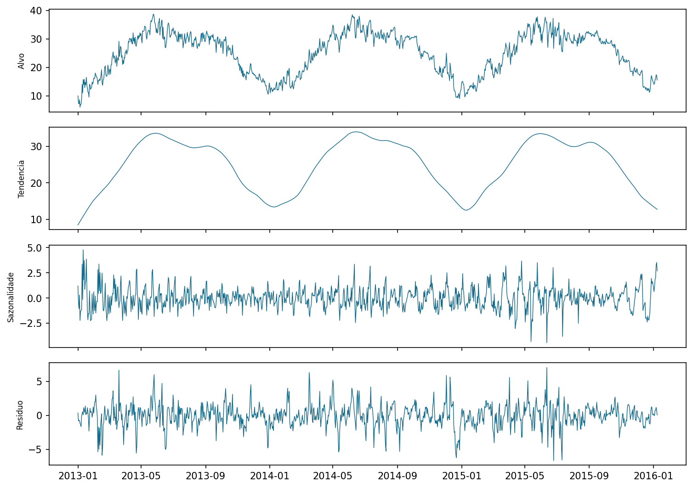

Forca sazonal 0.271; periodo selecionado m=30. Fases detectadas: alta (2013-01-24 a 2013-05-26), queda (2013-06-06 a 2013-08-06), queda (2013-09-06 a 2014-01-08), alta (2014-01-19 a 2014-06-12). A decomposicao usa apenas dados anteriores ao teste.

### pilgrims_close

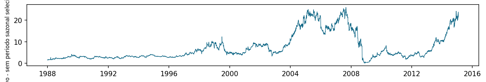

Forca sazonal -0.006; periodo selecionado m=1. Fases detectadas: estavel (1990-05-23 a 1995-05-11), alta (1996-06-25 a 1998-12-07), queda (1999-01-25 a 2000-04-24), alta (2000-08-09 a 2001-11-23). A decomposicao usa apenas dados anteriores ao teste.

### microsoft_open

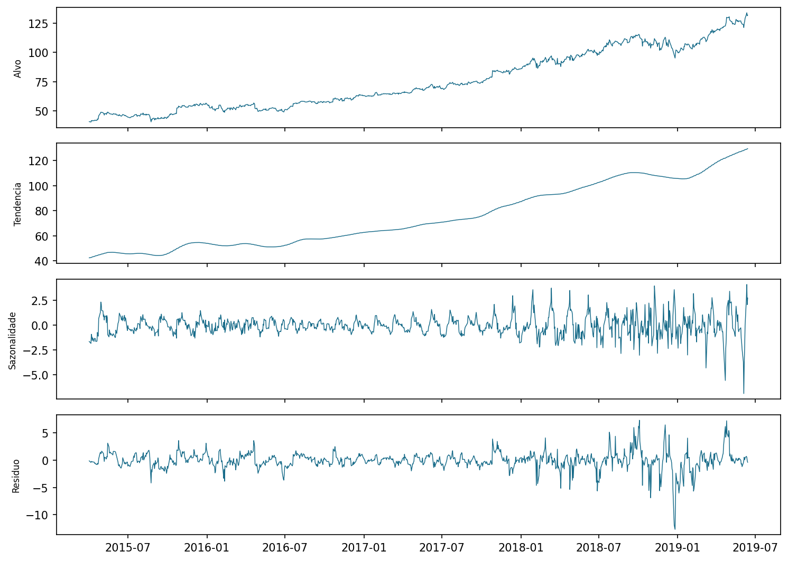

Forca sazonal 0.201; periodo selecionado m=30. Fases detectadas: queda (2015-06-12 a 2015-08-28), alta (2015-09-09 a 2015-12-10), alta (2016-06-06 a 2018-09-21), queda (2018-10-02 a 2019-01-02). A decomposicao usa apenas dados anteriores ao teste.

### sales_profit

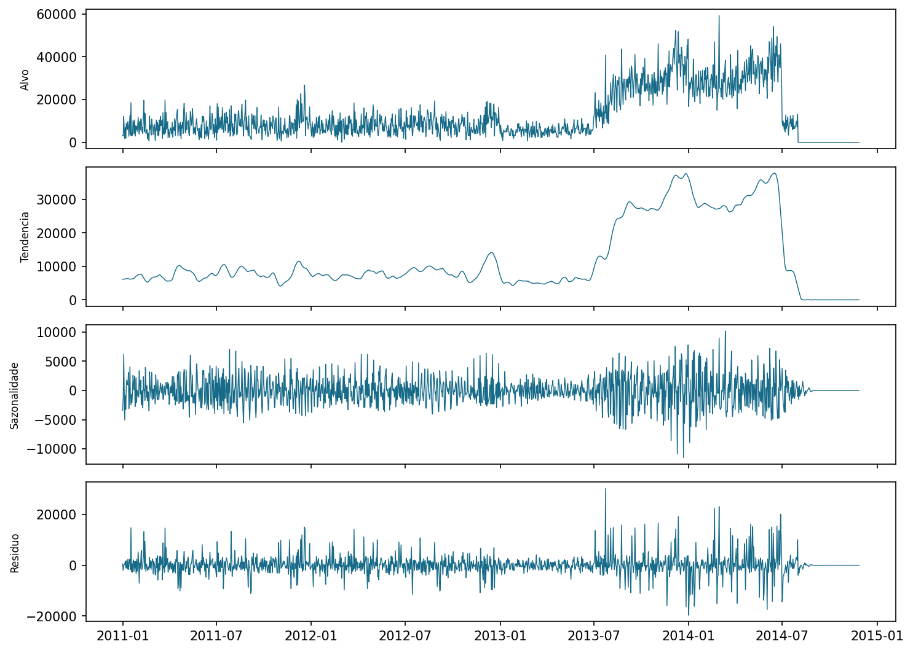

Forca sazonal 0.156; periodo selecionado m=12. Fases detectadas: estavel (2011-01-01 a 2011-03-14), estavel (2013-01-29 a 2013-06-02), alta (2013-06-03 a 2013-09-23), alta (2014-03-20 a 2014-05-27). A decomposicao usa apenas dados anteriores ao teste.

### brasil_vitorias

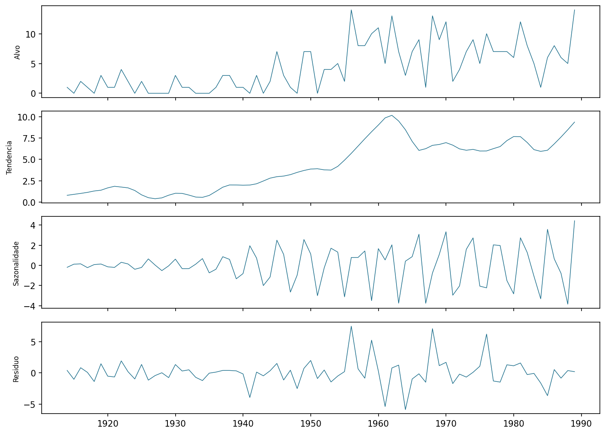

Forca sazonal 0.345; periodo selecionado m=4. Fases detectadas: alta (1916-01-01 a 1921-01-01), queda (1923-01-01 a 1927-01-01), alta (1928-01-01 a 1930-01-01), alta (1935-01-01 a 1939-01-01). A decomposicao usa apenas dados anteriores ao teste.

## 6. Protocolo walk-forward

Os 30% finais formam o teste. Dentro dos 70% anteriores, os 30% finais formam a validacao. A busca utiliza ate 30 origens distribuidas nessa janela; o teste utiliza todas as origens com blocos completos de h passos. Todos os modelos compartilham origens, horizonte e alvo.

| base | obs | h | treino | validacao | teste |
| --- | --- | --- | --- | --- | --- |
| delhi_temperatura | 1575 | 7 | 772 | 331 | 472 |
| pilgrims_close | 9751 | 5 | 4778 | 2048 | 2925 |
| microsoft_open | 1510 | 1 | 740 | 317 | 453 |
| sales_profit | 2039 | 7 | 999 | 428 | 612 |
| brasil_vitorias | 109 | 1 | 53 | 23 | 33 |

## 7. Modelos e otimizacao

SARIMAX busca ordens nao sazonais e sazonais por AIC/BIC e compara os dez melhores pelo MAE de validacao. Holt-Winters testa tendencia, sazonalidade e amortecimento. Random Forest sorteia 16 configuracoes; PLS avalia o numero de componentes. Nenhuma busca usa o teste.

| base | modelo | params | valor | segundos |
| --- | --- | --- | --- | --- |
| delhi_temperatura | SARIMAX | {'order': (1, 1, 2), 'seasonal_order': (0, 0, 2, 30)} | 0.327 | 3971.800 |
| delhi_temperatura | Holt-Winters | {'trend': 'add', 'seasonal': None, 'damped': True} | 2.010 | 32.000 |
| delhi_temperatura | Random Forest | {'n_estimators': 600, 'max_depth': None, 'max_features': 'sqrt', 'min_samples_split': 5, 'min_samples_leaf': 2} | 1.668 | 233.500 |
| delhi_temperatura | PLS | {'n_components': 20} | 1.916 | 21.500 |
| pilgrims_close | SARIMAX | {'order': (1, 1, 0), 'seasonal_order': (0, 0, 0, 0)} | - | 838.900 |
| pilgrims_close | Holt-Winters | {'trend': 'add', 'seasonal': None, 'damped': True} | inf | 100.800 |
| pilgrims_close | Random Forest | {'n_estimators': 300, 'max_depth': None, 'max_features': 'sqrt', 'min_samples_split': 5, 'min_samples_leaf': 2} | 0.499 | 3394.800 |
| pilgrims_close | PLS | {'n_components': 19} | 0.497 | 70.500 |
| microsoft_open | SARIMAX | {'order': (0, 0, 0), 'seasonal_order': (0, 0, 2, 30)} | - | 3736.200 |
| microsoft_open | Holt-Winters | {'trend': 'add', 'seasonal': 'add', 'damped': True} | inf | 215.600 |
| microsoft_open | Random Forest | {'n_estimators': 300, 'max_depth': 12, 'max_features': 0.5, 'min_samples_split': 5, 'min_samples_leaf': 1} | 1.225 | 797.100 |
| microsoft_open | PLS | {'n_components': 13} | 1.195 | 28.800 |
| sales_profit | SARIMAX | {'order': (0, 1, 2), 'seasonal_order': (0, 0, 2, 12)} | 0.369 | 438.100 |
| sales_profit | Holt-Winters | {'trend': 'add', 'seasonal': None, 'damped': True} | 4038.199 | 12.400 |
| sales_profit | Random Forest | {'n_estimators': 600, 'max_depth': 12, 'max_features': 'sqrt', 'min_samples_split': 5, 'min_samples_leaf': 1} | 4079.100 | 302.000 |
| sales_profit | PLS | {'n_components': 5} | 4791.286 | 20.500 |
| brasil_vitorias | SARIMAX | {'order': (0, 1, 2), 'seasonal_order': (0, 0, 2, 4)} | 0.216 | 11.200 |
| brasil_vitorias | Holt-Winters | {'trend': None, 'seasonal': 'add', 'damped': False} | 2.662 | 2.800 |
| brasil_vitorias | Random Forest | {'n_estimators': 300, 'max_depth': 12, 'max_features': 'sqrt', 'min_samples_split': 2, 'min_samples_leaf': 1} | 2.875 | 38.200 |
| brasil_vitorias | PLS | {'n_components': 1} | 2.837 | 8.700 |

Grade completa e alternativas: resultados/busca.csv. Parametros de suavizacao: resultados/holtwinters_suavizacao.csv.

## 8. Comparacao por MAE

| base | modelo | MAE | posicao |
| --- | --- | --- | --- |
| brasil_vitorias | Holt-Winters | 2.644 | 1 |
| brasil_vitorias | PLS | 2.677 | 2 |
| brasil_vitorias | SARIMAX | 2.859 | 3 |
| brasil_vitorias | Random Forest | 2.905 | 4 |
| delhi_temperatura | Holt-Winters | 1.885 | 1 |
| delhi_temperatura | PLS | 1.981 | 2 |
| delhi_temperatura | Random Forest | 2.022 | 3 |
| delhi_temperatura | SARIMAX | 2.027 | 4 |
| microsoft_open | Random Forest | 2.321 | 1 |
| microsoft_open | PLS | 2.495 | 2 |
| microsoft_open | Holt-Winters | 2.542 | 3 |
| microsoft_open | SARIMAX | 2.542 | 3 |
| pilgrims_close | Holt-Winters | 0.616 | 1 |
| pilgrims_close | SARIMAX | 0.616 | 1 |
| pilgrims_close | PLS | 0.829 | 3 |
| pilgrims_close | Random Forest | 0.875 | 4 |
| sales_profit | Random Forest | 5479.244 | 1 |
| sales_profit | Holt-Winters | 5639.242 | 2 |
| sales_profit | SARIMAX | 5720.228 | 3 |
| sales_profit | PLS | 5974.187 | 4 |

| modelo | vitorias | posicao_media |
| --- | --- | --- |
| Holt-Winters | 3 | 1.600 |
| Random Forest | 2 | 2.600 |
| SARIMAX | 1 | 2.800 |
| PLS | 0 | 2.600 |

delhi_temperatura: Holt-Winters venceu (MAE 1.885); SARIMAX teve o maior erro (2.027). Horizonte h=7, periodo m=30, forca sazonal 0.271. Essas caracteristicas sugerem hipoteses, nao causalidade.

pilgrims_close: Holt-Winters venceu (MAE 0.616); Random Forest teve o maior erro (0.875). Horizonte h=5, periodo m=1, forca sazonal -0.006. Essas caracteristicas sugerem hipoteses, nao causalidade.

microsoft_open: Random Forest venceu (MAE 2.321); SARIMAX teve o maior erro (2.542). Horizonte h=1, periodo m=30, forca sazonal 0.201. Essas caracteristicas sugerem hipoteses, nao causalidade.

sales_profit: Random Forest venceu (MAE 5479.244); PLS teve o maior erro (5974.187). Horizonte h=7, periodo m=12, forca sazonal 0.156. Essas caracteristicas sugerem hipoteses, nao causalidade.

brasil_vitorias: Holt-Winters venceu (MAE 2.644); Random Forest teve o maior erro (2.905). Horizonte h=1, periodo m=4, forca sazonal 0.345. Essas caracteristicas sugerem hipoteses, nao causalidade.

## 9. Residuos e Ljung-Box

Residuo = observado - previsto. Vies positivo indica subestimacao; negativo indica superestimacao. Ljung-Box p <= 0,05 aponta autocorrelacao remanescente; p > 0,05 nao prova independencia.

| base | modelo | n | lags | vies | desvio | lb_stat | p_valor | ruido_branco |
| --- | --- | --- | --- | --- | --- | --- | --- | --- |
| brasil_vitorias | Holt-Winters | 33 | 6 | 0.133 | 3.587 | 7.479 | 0.279 | sim |
| brasil_vitorias | PLS | 33 | 6 | 1.035 | 3.504 | 7.763 | 0.256 | sim |
| brasil_vitorias | Random Forest | 33 | 6 | 1.165 | 3.834 | 8.629 | 0.196 | sim |
| brasil_vitorias | SARIMAX | 33 | 6 | 0.122 | 3.595 | 15.803 | 0.015 | nao |
| delhi_temperatura | Holt-Winters | 469 | 10 | 0.002 | 2.503 | 293.906 | 0.000 | nao |
| delhi_temperatura | PLS | 469 | 10 | 0.495 | 2.469 | 519.467 | 0.000 | nao |
| delhi_temperatura | Random Forest | 469 | 10 | 0.953 | 2.315 | 425.481 | 0.000 | nao |
| delhi_temperatura | SARIMAX | 469 | 10 | -0.090 | 5.066 | 6.500 | 0.772 | sim |
| microsoft_open | Holt-Winters | 453 | 10 | 0.223 | 3.529 | 16.744 | 0.080 | sim |
| microsoft_open | PLS | 453 | 10 | 0.967 | 3.407 | 124.749 | 0.000 | nao |
| microsoft_open | Random Forest | 453 | 10 | 0.604 | 3.370 | 109.416 | 0.000 | nao |
| microsoft_open | SARIMAX | 453 | 10 | 0.223 | 3.529 | 16.744 | 0.080 | sim |
| pilgrims_close | Holt-Winters | 2925 | 10 | -0.008 | 0.886 | 1832.714 | 0.000 | nao |
| pilgrims_close | PLS | 2925 | 10 | 0.037 | 1.170 | 3743.259 | 0.000 | nao |
| pilgrims_close | Random Forest | 2925 | 10 | 0.045 | 1.198 | 5714.099 | 0.000 | nao |
| pilgrims_close | SARIMAX | 2925 | 10 | -0.008 | 0.886 | 1832.714 | 0.000 | nao |
| sales_profit | Holt-Winters | 609 | 10 | 159.468 | 8473.091 | 116.197 | 0.000 | nao |
| sales_profit | PLS | 609 | 10 | 551.602 | 8742.842 | 305.445 | 0.000 | nao |
| sales_profit | Random Forest | 609 | 10 | 1689.252 | 7962.880 | 128.526 | 0.000 | nao |
| sales_profit | SARIMAX | 609 | 10 | 187.582 | 8527.976 | 143.649 | 0.000 | nao |

### delhi_temperatura - Holt-Winters (melhor MAE)

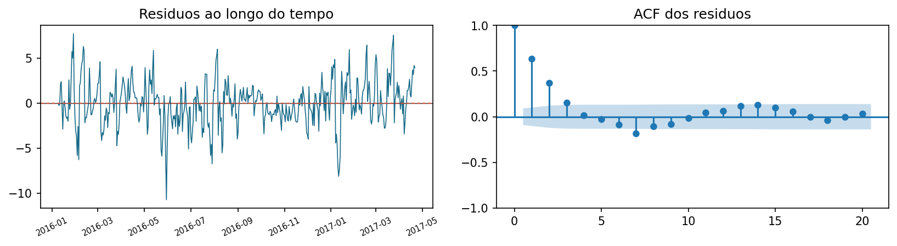

Vies 0.002; desvio 2.503; Ljung-Box p=3.016e-57. Ha autocorrelacao remanescente.

### pilgrims_close - Holt-Winters (melhor MAE)

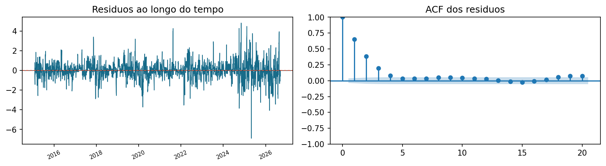

Vies -0.008; desvio 0.886; Ljung-Box p=0. Ha autocorrelacao remanescente.

### microsoft_open - Random Forest (melhor MAE)

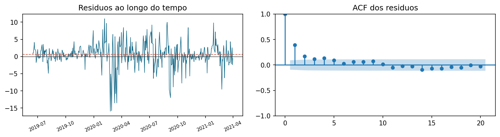

Vies 0.604; desvio 3.370; Ljung-Box p=6.998e-19. Ha autocorrelacao remanescente.

### sales_profit - Random Forest (melhor MAE)

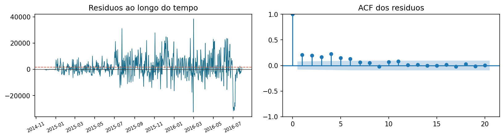

Vies 1689.252; desvio 7962.880; Ljung-Box p=9.332e-23. Ha autocorrelacao remanescente.

### brasil_vitorias - Holt-Winters (melhor MAE)

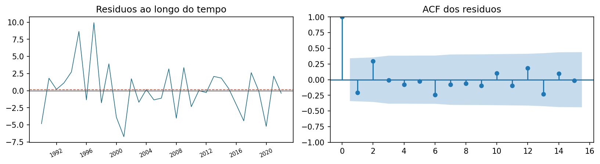

Vies 0.133; desvio 3.587; Ljung-Box p=0.2788. Sem evidencia suficiente de autocorrelacao nos lags avaliados.

## 10. Importancia das features

Random Forest: importancia nativa e permutation na validacao. PLS: coeficientes padronizados, VIP e permutation. Externas sao destacadas com sua disponibilidade temporal.

| base | modelo | feature | permutation | tipo | disponibilidade |
| --- | --- | --- | --- | --- | --- |
| sales_profit | PLS | transaction_count_lag_7 | 3875.626 | externa | defasada |
| sales_profit | PLS | media_12 | 2024.837 | interna | - |
| sales_profit | PLS | media_8 | 1617.757 | interna | - |
| sales_profit | Random Forest | media_12 | 1597.012 | interna | - |
| sales_profit | Random Forest | media_8 | 1340.551 | interna | - |
| sales_profit | Random Forest | transaction_count_lag_7 | 988.156 | externa | defasada |
| pilgrims_close | PLS | lag_5 | 5.878 | interna | - |
| microsoft_open | PLS | lag_1 | 1.630 | interna | - |
| delhi_temperatura | PLS | semana_cos | 1.201 | interna | - |
| delhi_temperatura | PLS | media_12 | 0.999 | interna | - |
| pilgrims_close | PLS | Low_lag_5 | 0.898 | externa | defasada |
| pilgrims_close | Random Forest | lag_5 | 0.762 | interna | - |
| pilgrims_close | Random Forest | Low_lag_5 | 0.687 | externa | defasada |
| pilgrims_close | PLS | media_8 | 0.641 | interna | - |
| pilgrims_close | Random Forest | media_4 | 0.597 | interna | - |
| delhi_temperatura | PLS | mes_cos | 0.517 | interna | - |
| delhi_temperatura | Random Forest | semana_cos | 0.206 | interna | - |
| microsoft_open | Random Forest | close_lag_1 | 0.196 | externa | conhecida |
| microsoft_open | PLS | close_lag_1 | 0.190 | externa | conhecida |
| microsoft_open | PLS | lag_2 | 0.163 | interna | - |
| delhi_temperatura | Random Forest | media_4 | 0.159 | interna | - |
| brasil_vitorias | Random Forest | desvio_8 | 0.062 | interna | - |
| brasil_vitorias | Random Forest | desvio_4 | 0.059 | interna | - |
| delhi_temperatura | Random Forest | media_8 | 0.050 | interna | - |
| brasil_vitorias | Random Forest | matches_played_lag_1 | 0.042 | externa | defasada |
| brasil_vitorias | PLS | desvio_8 | 0.041 | interna | - |
| microsoft_open | Random Forest | lag_1 | 0.027 | interna | - |
| brasil_vitorias | PLS | lag_4 | 0.022 | interna | - |
| brasil_vitorias | PLS | desvio_12 | 0.020 | interna | - |
| microsoft_open | Random Forest | lag_2 | 0.005 | interna | - |

SARIMAX: sinal e significancia das exogenas em resultados/coeficientes_sarimax.csv. Holt-Winters e univariado; nivel, tendencia e sazonalidade constam em resultados/holtwinters_estado.csv.

## 11. Estudo do PLS

PLS Regression constrói componentes latentes que maximizam a covariancia entre combinacoes das entradas e o alvo. Diferentemente do PCA, a direcao do alvo orienta a projecao. As features sao padronizadas para que unidades distintas nao dominem os componentes. A explicacao completa (hipoteses, hiperparametros, otimizacao, VIP e desempenho por base) esta em DOCUMENTACAO_PLS.md.

Preparacao propria do PLS: media_4 e delta_nivel sao combinacoes lineares exatas de outras features e sao removidas no treino inicial, porque componentes alem do posto de X tornam o ajuste instavel. As externas sao winsorizadas nos quantis 0,5% e 99,5% de cada janela de treino, por causa de medicoes de pressao impossiveis em Delhi; lags e janelas do alvo nao sao limitados.

Poucos componentes podem subajustar; muitos aproximam o PLS da regressao linear comum. A busca e uma grade exaustiva de 1 ate o posto de X, com MAE walk-forward de validacao. PLS e util com entradas correlacionadas, mas sua projecao linear pode perder para arvores em efeitos nao lineares.

| base | n_components | n_features_pls | features_redundantes | mae_sobre_ingenuo |
| --- | --- | --- | --- | --- |
| delhi_temperatura | 20 | 23 | media_4, delta_nivel | 1.019 |
| pilgrims_close | 19 | 20 | media_4, delta_nivel | 1.346 |
| microsoft_open | 13 | 22 | media_4, delta_nivel | 0.982 |
| sales_profit | 5 | 21 | media_4, delta_nivel | 0.816 |
| brasil_vitorias | 1 | 17 | media_4, delta_nivel, semana_cos | 0.701 |

| base | MAE | posicao | params |
| --- | --- | --- | --- |
| brasil_vitorias | 2.677 | 2 | {'n_components': 1} |
| delhi_temperatura | 1.981 | 2 | {'n_components': 20} |
| microsoft_open | 2.495 | 2 | {'n_components': 13} |
| pilgrims_close | 0.829 | 3 | {'n_components': 19} |
| sales_profit | 5974.187 | 4 | {'n_components': 5} |

VIP acima de 1 e uma regra exploratoria, nao teste de significancia. Interpretar VIP, coeficientes e permutation em conjunto.

## 12. Conclusoes, limitacoes e recomendacoes

Nao houve um vencedor universal. Comparar MAE apenas dentro da mesma base; usar posicoes para sintetizar as cinco bases. Conferir tambem vies e autocorrelacao residual, mesmo quando o MAE e baixo.

Limitacoes: cinco bases fixas, validacao com ate 30 origens por configuracao, exogenas futuras representadas por defasagens e fontes/unidades originais ainda a confirmar. Recomenda-se revisar os casos com autocorrelacao e preencher a procedencia dos dados.

## 13. Referencias

Enunciado: n2_series_temporais.pdf, paginas 1-13, neste projeto. Codigo e dados: pipeline.ipynb, prepare_bases.ipynb, bases/raw/ e bases/*.csv. Bibliotecas: pandas, statsmodels, scikit-learn, matplotlib e ReportLab.

## 14. Apendices tecnicos e registro de demandas

Arquivos tecnicos: resultados/previsoes.csv, hiperparametros.csv, busca.csv, mae_por_base.csv, placar_modelos.csv, ljung_box.csv e importancia_features.csv. Graficos das combinacoes adicionais:

### delhi_temperatura - SARIMAX

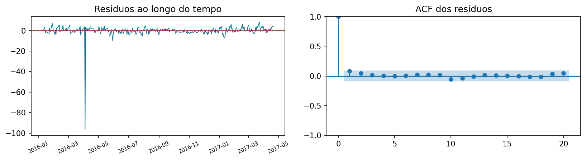

Vies -0.090; desvio 5.066; Ljung-Box p=0.7717; sem evidencia suficiente de autocorrelacao.

### delhi_temperatura - Random Forest

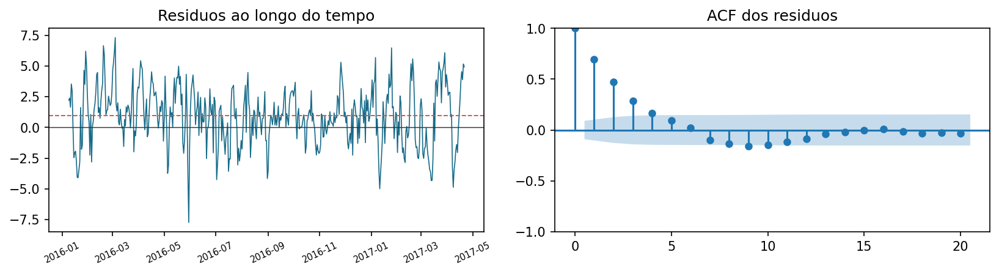

Vies 0.953; desvio 2.315; Ljung-Box p=3.526e-85; autocorrelacao remanescente.

### delhi_temperatura - PLS

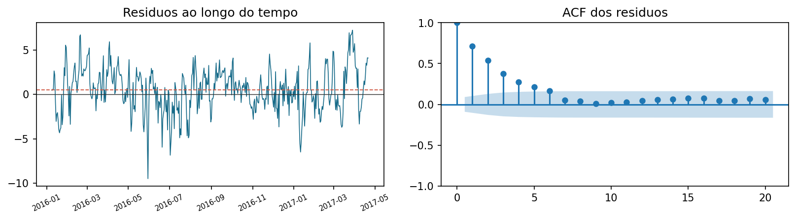

Vies 0.495; desvio 2.469; Ljung-Box p=3.046e-105; autocorrelacao remanescente.

### pilgrims_close - SARIMAX

Vies -0.008; desvio 0.886; Ljung-Box p=0; autocorrelacao remanescente.

### pilgrims_close - Random Forest

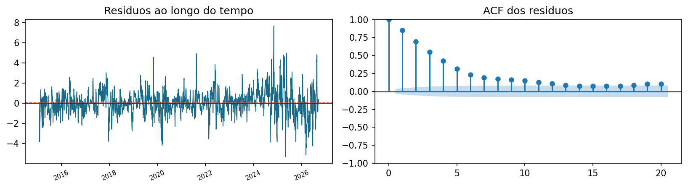

Vies 0.045; desvio 1.198; Ljung-Box p=0; autocorrelacao remanescente.

### pilgrims_close - PLS

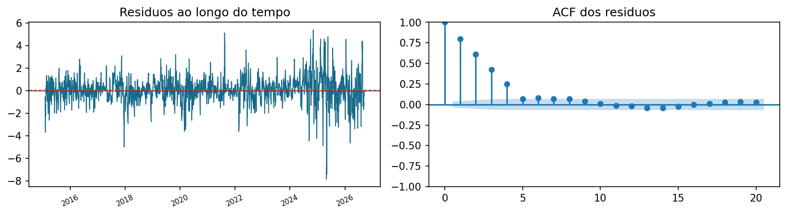

Vies 0.037; desvio 1.170; Ljung-Box p=0; autocorrelacao remanescente.

### microsoft_open - SARIMAX

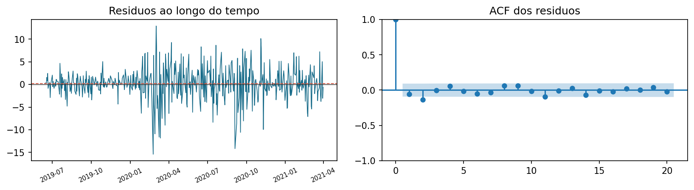

Vies 0.223; desvio 3.529; Ljung-Box p=0.08022; sem evidencia suficiente de autocorrelacao.

### microsoft_open - Holt-Winters

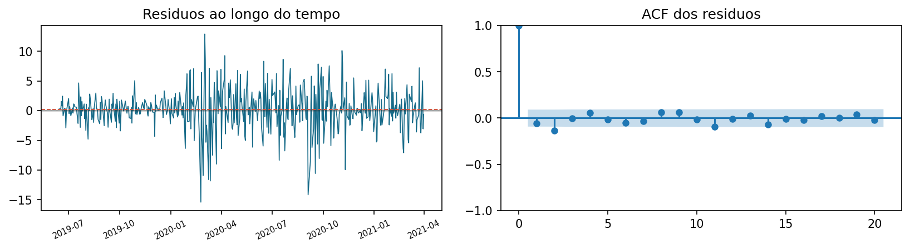

Vies 0.223; desvio 3.529; Ljung-Box p=0.08022; sem evidencia suficiente de autocorrelacao.

### microsoft_open - PLS

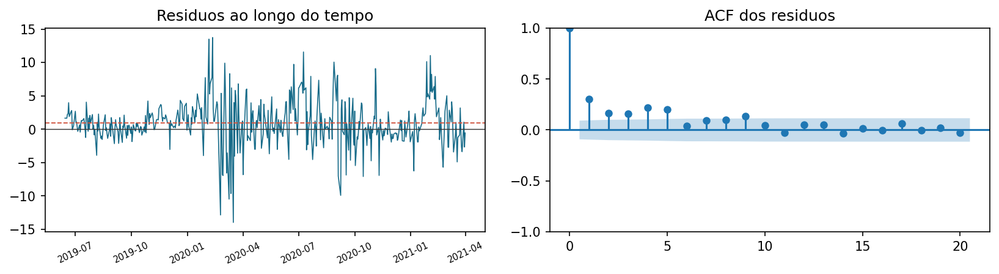

Vies 0.967; desvio 3.407; Ljung-Box p=5.485e-22; autocorrelacao remanescente.

### sales_profit - SARIMAX

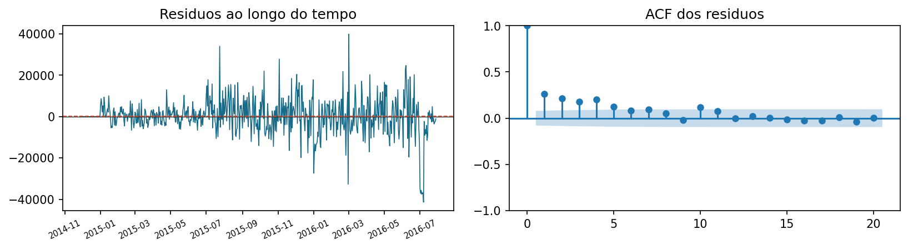

Vies 187.582; desvio 8527.976; Ljung-Box p=7.523e-26; autocorrelacao remanescente.

### sales_profit - Holt-Winters

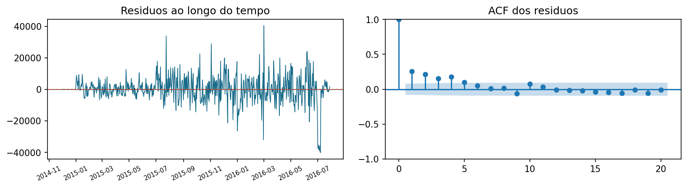

Vies 159.468; desvio 8473.091; Ljung-Box p=2.986e-20; autocorrelacao remanescente.

### sales_profit - PLS

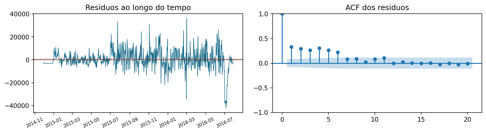

Vies 551.602; desvio 8742.841; Ljung-Box p=1.097e-59; autocorrelacao remanescente.

### brasil_vitorias - SARIMAX

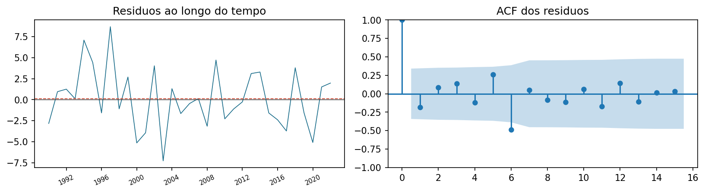

Vies 0.122; desvio 3.595; Ljung-Box p=0.01485; autocorrelacao remanescente.

### brasil_vitorias - Random Forest

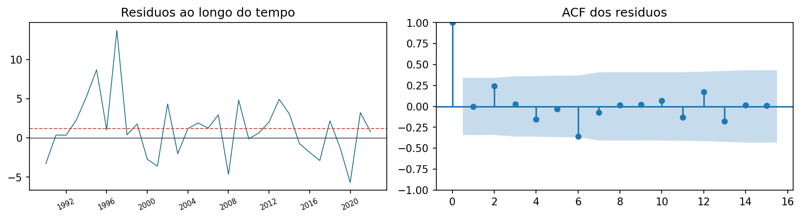

Vies 1.165; desvio 3.834; Ljung-Box p=0.1955; sem evidencia suficiente de autocorrelacao.

### brasil_vitorias - PLS

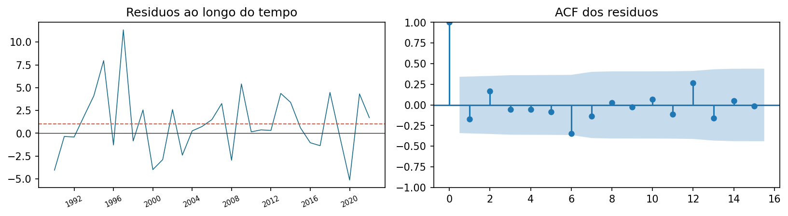

Vies 1.035; desvio 3.504; Ljung-Box p=0.2559; sem evidencia suficiente de autocorrelacao.

### Registro diario de demandas

Uma linha por demanda, integrante e dia. 

| Data | Integrante | Demanda | Evidência | Carga | Complexidade | Status |
| --- | --- | --- | --- | --- | --- | --- |
| 10/09/2026 | Fernando Paiva | Organização geral do projeto | N/A | Baixa | Média | Concluída |
| 15/09/2026 | Fernando Paiva | Definição das especificações | N/A | Média | Média | Concluída |
| 15/09/2026 | Fernando Paiva | Definição das bases | N/A | Baixa | Média | Concluída |
| 17/09/2026 | Fernando Paiva | Adição de elementos na pipeline padrão | pipeline.ipynb | Média | Média | Concluída |
| 10/09/2026 | Giovanna Pelati | Organização geral do projeto | N/A | Baixa | Média | Concluída |
| 22/09/2026 | Giovanna Pelati | Revisão e refinamento da pipeline geral do projeto | pipeline.ipynb | Alta | Média | Concluída |
| 22/09/2026 | Giovanna Pelati | Implementação do modelo na pipeline | pipeline.ipynb | Média | Alta | Concluída |
| 22/09/2026 | Giovanna Pelati | Documentação do modelo principal | N/A | Média | Média | Concluída |
| 24/09/2026 | Giovanna Pelati | Estudo do modelo de especialização | N/A | Média | Alta | Concluída |
| 10/09/2026 | João Vargas | Organização geral do projeto | N/A | Baixa | Média | Concluída |
| 15/09/2026 | João Vargas | Estudo e documentação do projeto | RELATORIO.md | Média | Média | Concluída |
| 17/09/2026 | João Vargas | Criação da base do relatório e entendimento do pipeline | RELATORIO.md, relatorio.html, relatorio.pdf | Média | Média | Concluída |
| 22/09/2026 | João Vargas | Inclusão de dados sobre as bases no relatório | RELATORIO.md, relatorio.html, relatorio.pdf | Média | Alta | Concluída |
| 24/09/2026 | João Vargas | Revisão e refinamento da pipeline geral do projeto | pipeline.ipynb | Alta | Média | Concluída |
| 10/09/2026 | Matheus Cury | Organização geral do projeto | N/A | Baixa | Média | Concluída |
| 15/09/2026 | Matheus Cury | Criação dos arquivos e da base do projeto | Pasta inicial do projeto e arquivos iniciais + pipeline.ipynb | Média | Alta | Concluída |
| 17/09/2026 | Matheus Cury | Adição de validação de resíduos e outras análises pós treino/teste no pipeline | pipeline.ipynb | Média | Média | Concluída |
| 22/09/2026 | Matheus Cury | Inclusão e análise inicial das bases (PACF, ACF, variáveis exógenas etc.) na pipeline base | pipeline.ipynb | Alta | Média | Concluída |
| 24/09/2026 | Matheus Cury | Adição de Feature Importance e finalização da pipeline | pipeline.ipynb | Alta | Média | Concluída |
| 10/09/2026 | Sophia Gasparetto | Organização geral do projeto | N/A | Baixa | Média | Concluída |
| 10/09/2026 | Sophia Gasparetto | Pesquisa da base do grupo | Link da base do grupo | Baixa | Média | Concluída |
| 15/09/2026 | Sophia Gasparetto | Script inicial de limpeza da base selecionada | Base selecionada com processamento inicial, definição de exógenas e alvo | Média | Média | Concluída |
| 17/09/2026 | Sophia Gasparetto | Criação da pipeline de processamento geral das bases selecionadas por todos os grupos | Jupyter Notebook com processamento individual de cada base | Alta | Média | Concluída |
| 22/09/2026 | Sophia Gasparetto | Criação da documentação do processamento inicial das bases | N/A | Média | Média | Concluída |
| 24/09/2026 | Sophia Gasparetto | Criação da documentação e análise das bases | N/A | Média | Média | Concluída |
