# Modelagem comparativa de séries temporais — Grupo 5 (PLS)

Gerado a partir dos artefatos persistidos em 2026-10-05T11:03:05-03:00. Conjunto oficial: 5 bases × 4 modelos = 20 combinações.

## 1. Resumo executivo

O trabalho compara SARIMAX, Holt-Winters, Random Forest e PLS Regression, o modelo de especialização do Grupo 5, em cinco séries temporais com variáveis externas. Todos os modelos usam as mesmas origens, o mesmo horizonte e o mesmo conjunto de teste, com validação walk-forward e hiperparâmetros escolhidos antes do teste. A métrica é o MAE, comparado apenas dentro de cada base.

Não há modelo universal: **SARIMAX** venceu Microsoft; **Holt-Winters** venceu Brasil, Delhi e Pilgrim's Pride; **Random Forest** venceu Sales. No placar, Holt-Winters lidera com 3 vitórias e posição média 1,8. O PLS não venceu nenhuma base, teve posição média 2,8 e foi o 2º colocado nas bases Brasil e Delhi. Ele foi mais útil onde o alvo é ruidoso e as features são muito correlacionadas, e menos útil onde o último valor observado já é quase toda a informação disponível (seção 11).

Três limitações condicionam a leitura: em Sales, cinco meses sem nenhuma transação na fonte viraram lucro zero na preparação (seção 4); nos modelos com horizonte maior que 1 o Ljung-Box agregado rejeita ruído branco por construção, e por isso o diagnóstico é feito também por passo (seção 9); e a winsorização das externas do PLS foi decidida depois de um erro observado no teste de Delhi (seção 11). Kalman e Fourier+ACF são bônus e não entram no placar.

*Vencedor de cada base (MAE de teste)*

| base | vencedor | MAE | MAE ingênuo | ganho sobre o ingênuo (%) |
| --- | --- | --- | --- | --- |
| Brasil | Holt-Winters | 2,645 | 3,818 | 30,7 |
| Delhi | Holt-Winters | 1,885 | 1,944 | 3,1 |
| Microsoft | SARIMAX | 1,503 | 2,542 | 40,9 |
| Pilgrim's Pride | Holt-Winters | 0,616 | 0,616 | 3,47e-08 |
| Sales | Random Forest | 5.479,244 | 7.325,654 | 25,2 |

*Placar das 20 combinações oficiais*

| modelo | vitórias | posição média | melhor posição | pior posição |
| --- | --- | --- | --- | --- |
| Holt-Winters | 3 | 1,8 | 1 | 4 |
| SARIMAX | 1 | 2,6 | 1 | 4 |
| Random Forest | 1 | 2,8 | 1 | 4 |
| PLS | 0 | 2,8 | 2 | 4 |

## 2. Identificação dos integrantes e divisão de responsabilidades

O grupo é formado por Fernando Paiva, Giovanna Pelati, João Vargas, Matheus Cury e Sophia Gasparetto. A tabela resume as frentes de cada integrante; o registro diário completo, com carga, complexidade, status e evidência de cada demanda, está no apêndice (seção 14). As evidências são commits do repositório e arquivos entregues; quando não há arquivo, a linha é marcada como relato do integrante.

*Divisão de responsabilidades*

| Integrante | demandas | demandas mais recentes | período |
| --- | --- | --- | --- |
| Fernando Paiva | 3 | Organização geral do projeto; Definição das especificações e das bases; Adição de elementos na pipeline padrão | 10/09/2026 a 17/09/2026 |
| Giovanna Pelati | 6 | Implementação do PLS (remoção de redundâncias; winsorização das externas; grade até o posto de X; VIP); Revisão final: reexecução isolada dos notebooks e verificação de reprodutibilidade das 31 configurações; Correção da divergência código x resultados (SARIMAX sem winsorização; Kalman refeito); limpeza do repositório; relatório final | 10/09/2026 a 05/10/2026 |
| João Vargas | 4 | Estudo e documentação do projeto; Base do relatório e entendimento da pipeline; Primeira versão do relatório (Markdown; HTML; PDF) e tabelas de MAE e Ljung-Box | 10/09/2026 a 27/09/2026 |
| Matheus Cury | 11 | Primeira rodada de treino dos modelos; Rodada completa do pipeline (5 bases x 4 modelos) com caches do SARIMAX; Bônus Kalman e Fourier+ACF; checkpoints; gerador do relatório; consolidação dos artefatos | 10/09/2026 a 01/10/2026 |
| Sophia Gasparetto | 5 | Notebook reprodutível de preparação das cinco bases; Correção da preparação das bases Brasil e Sales; Exploração aprofundada das bases (item 5.1): estatísticas; checagens de consistência; painéis | 10/09/2026 a 29/09/2026 |

## 3. Documentação das cinco bases e das variáveis externas

As cinco bases são as versões congeladas em `bases/raw/`, transformadas pelo `prepare_bases.ipynb` em séries prontas para modelagem (`bases/*_prepared.csv`). A reexecução da preparação reproduz os cinco arquivos byte a byte, e o SHA-256 de cada um fica registrado abaixo.

*Visão geral das bases*

| base | descrição | alvo | unidade | frequência | período | observações | horizonte h |
| --- | --- | --- | --- | --- | --- | --- | --- |
| Delhi | Temperatura média diária em Delhi (Índia), com umidade, vento e pressão do mesmo dia. | meantemp | °C | diária | 2013-01-01 a 2017-04-24 | 1.575 | 7 |
| Pilgrim's Pride | Preço de fechamento diário da ação da Pilgrim's Pride, com abertura, máxima, mínima e volume da sessão. | Close | USD por ação (NASDAQ: PPC) | pregões observados | 1987-12-30 a 2026-09-16 | 9.751 | 5 |
| Microsoft | Preço de abertura da sessão da Microsoft, com fechamento e volume da sessão anterior. | target_open | USD por ação (NASDAQ: MSFT) | pregões observados | 2015-04-02 a 2021-03-31 | 1.510 | 1 |
| Sales | Lucro diário de vendas de bicicletas e acessórios na Europa, com quantidade vendida e número de transações. | Profit | moeda não informada na fonte | diária | 2011-01-01 a 2016-07-31 | 2.039 | 7 |
| Brasil | Vitórias anuais da Seleção Brasileira, com partidas disputadas e amistosos no ano. | victories | vitórias por ano | anual | 1914-01-01 a 2022-01-01 | 109 | 1 |

*Fontes e rastreabilidade*

| base | fonte | arquivo(s) bruto(s) | arquivo preparado | SHA-256 do preparado |
| --- | --- | --- | --- | --- |
| Delhi | https://www.kaggle.com/datasets/sumanthvrao/daily-climate-time-series-data | DailyDelhiClimateTrain.csv; DailyDelhiClimateTest.csv | daily_delhi_climate_prepared.csv | 41f38ab6840f7db11709d070a01f8ea593568225cdb1ce6ac0d34f1a8239549a |
| Pilgrim's Pride | https://www.kaggle.com/datasets/mandalorianforza/pilgrims-pride-ppc-daily-stock-price-history | Pilgrim_s_Pride_Corporation_1987-12-30_2026-09-16.csv | pilgrims_pride_prepared.csv | b517e7246915d1548d026155efab93e94f44b71cd4446e8068280b3f893784ab |
| Microsoft | https://www.kaggle.com/datasets/vijayvvenkitesh/microsoft-stock-time-series-analysis | Microsoft_Stock.csv | microsoft_stock_prepared.csv | efeee129496b40c1450e532ae7a1017e64353d53c4f9dc95e2673a375362d587 |
| Sales | https://www.kaggle.com/datasets/sadiqshah/bike-sales-in-europe | Sales.csv | sales_prepared.csv | 507b42cb5c1d4564971f0d09f601f0611ee59fc31f082ee051fc36d1894269dc |
| Brasil | https://www.kaggle.com/datasets/azminetoushikwasi/brazil-all-international-matches-19142023 | brazil.csv | brazil_prepared.csv | e7d2d3293b13b929f1af8acda01462db4e56f06a7a268cf5745c1ac710b5bd45 |

Horizontes: 7 dias em Delhi e Sales (uma semana à frente), 5 pregões em Pilgrim's (uma semana útil), 1 pregão em Microsoft (a abertura de amanhã) e 1 ano no Brasil. A data de origem é a última observação disponível em cada passo do walk-forward. As unidades de Delhi não constam na fonte e foram inferidas pela faixa de valores; as ações são cotadas em dólar na NASDAQ; a moeda de Sales não é informada.

### Dicionário das variáveis

*Papel, unidade e disponibilidade de cada variável (prepare_bases.ipynb)*

| Base | Variável | Papel | Descrição | Unidade | Disponibilidade |
| --- | --- | --- | --- | --- | --- |
| Delhi Climate | meantemp | Alvo | Temperatura média diária | °C | Não disponível |
| Delhi Climate | humidity | Externa | Umidade média diária | % (inferida pela faixa; a fonte não informa) | Somente defasada |
| Delhi Climate | wind_speed | Externa | Velocidade média do vento | km/h (inferida pela faixa; a fonte não informa) | Somente defasada |
| Delhi Climate | meanpressure | Externa | Pressão atmosférica média | hPa (inferida pela faixa; a fonte não informa) | Somente defasada |
| Pilgrim's Pride | Open | Externa | Preço de abertura | USD | Somente após a abertura |
| Pilgrim's Pride | High | Externa | Maior preço da sessão | USD | Somente defasada |
| Pilgrim's Pride | Low | Externa | Menor preço da sessão | USD | Somente defasada |
| Pilgrim's Pride | Close | Alvo | Preço de fechamento | USD | Não disponível |
| Pilgrim's Pride | Volume | Externa | Volume negociado | Quantidade | Somente defasada |
| Pilgrim's Pride | Dividends | Externa | Dividendo registrado | USD | Depende do anúncio |
| Pilgrim's Pride | Stock Splits | Externa | Fator de desdobramento | Razão | Depende do anúncio |
| Seleção Brasileira | victories | Alvo | Vitórias no ano | Contagem | Não disponível |
| Seleção Brasileira | matches_played | Externa | Partidas disputadas no ano | Contagem | Somente defasada |
| Seleção Brasileira | friendly_matches | Externa | Amistosos disputados no ano | Contagem | Somente defasada |
| Bike Sales | Profit | Alvo | Lucro total diário | Moeda não informada | Não disponível |
| Bike Sales | order_quantity | Externa | Itens vendidos no dia | Unidades | Somente defasada |
| Bike Sales | transaction_count | Externa | Transações no dia | Contagem | Somente defasada |
| Microsoft Stock | target_open | Alvo | Preço de abertura da sessão | USD | Não disponível |
| Microsoft Stock | close_lag_1 | Externa defasada | Fechamento da sessão anterior | USD | Disponível |
| Microsoft Stock | volume_lag_1 | Externa defasada | Volume da sessão anterior | Quantidade | Disponível |

### Série-alvo e variáveis externas

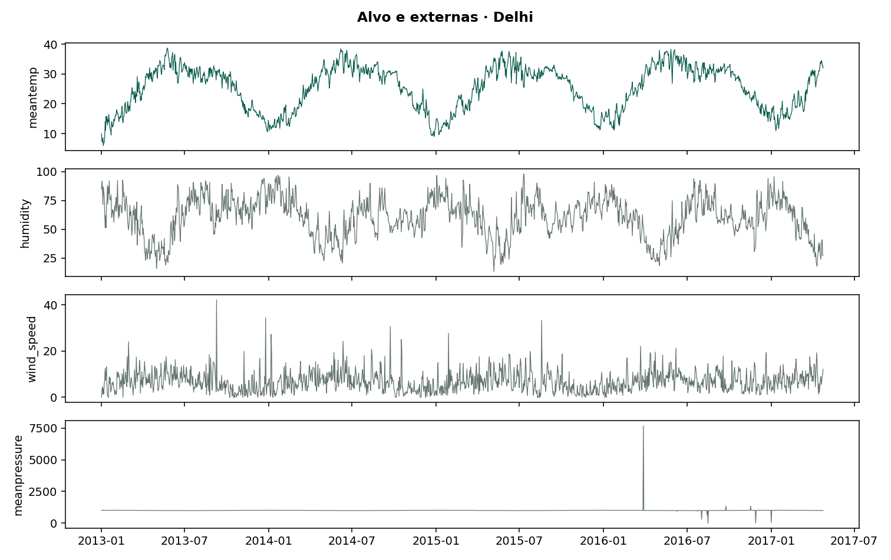

*Delhi: alvo e variáveis externas na série completa*

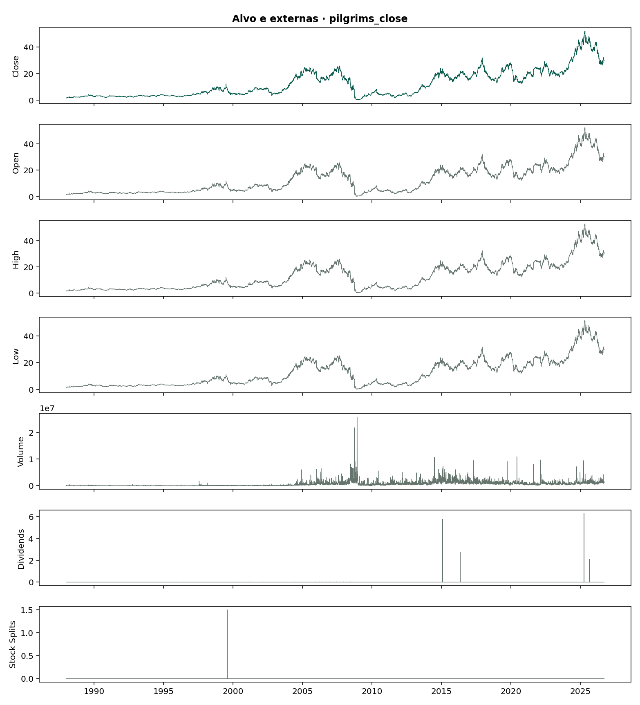

*Pilgrim's Pride: alvo e variáveis externas na série completa*

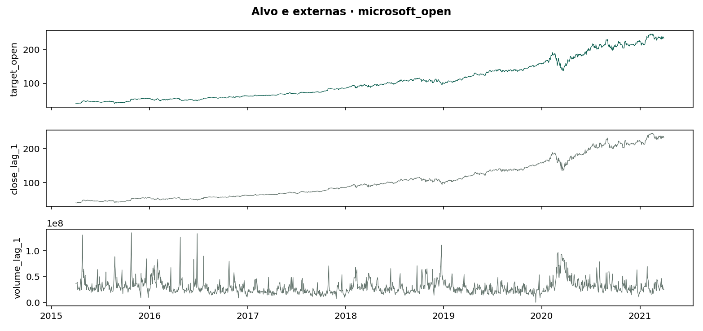

*Microsoft: alvo e variáveis externas na série completa*

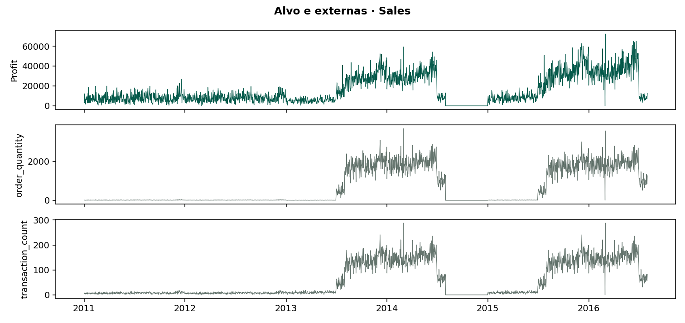

*Sales: alvo e variáveis externas na série completa*

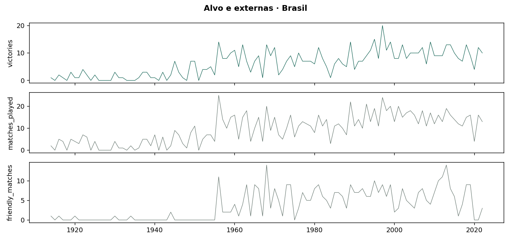

*Brasil: alvo e variáveis externas na série completa*

### Painéis exploratórios

Cada painel reúne evolução com média móvel, distribuição do alvo, correlações, perfil por período, relação com uma externa relevante e variação entre observações consecutivas.

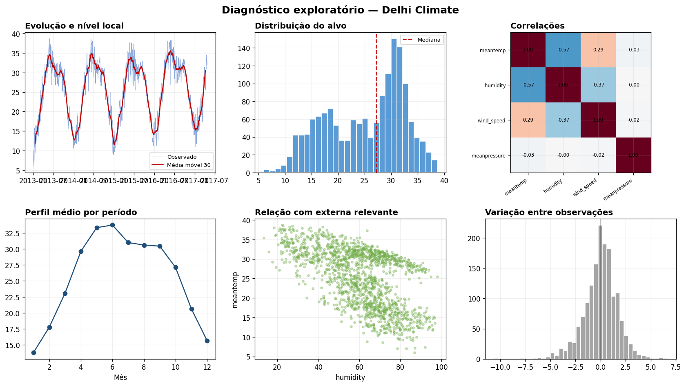

*Delhi: diagnóstico exploratório*

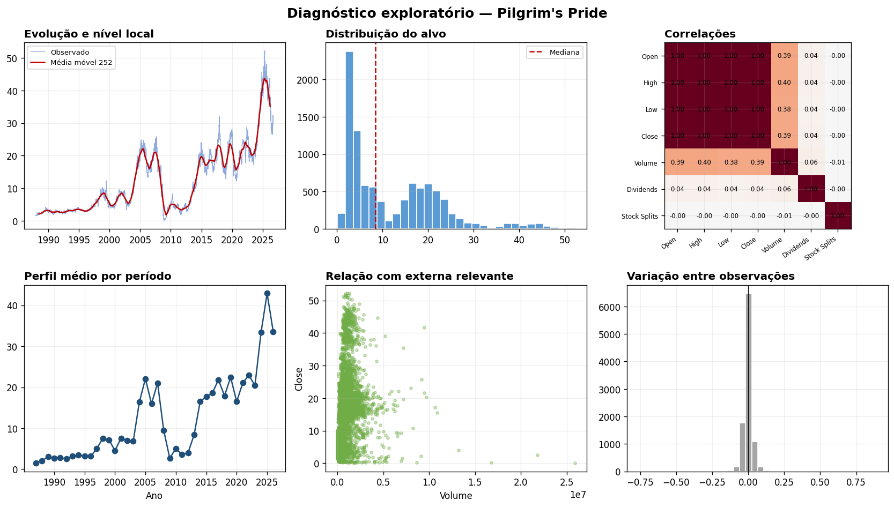

*Pilgrim's Pride: diagnóstico exploratório*

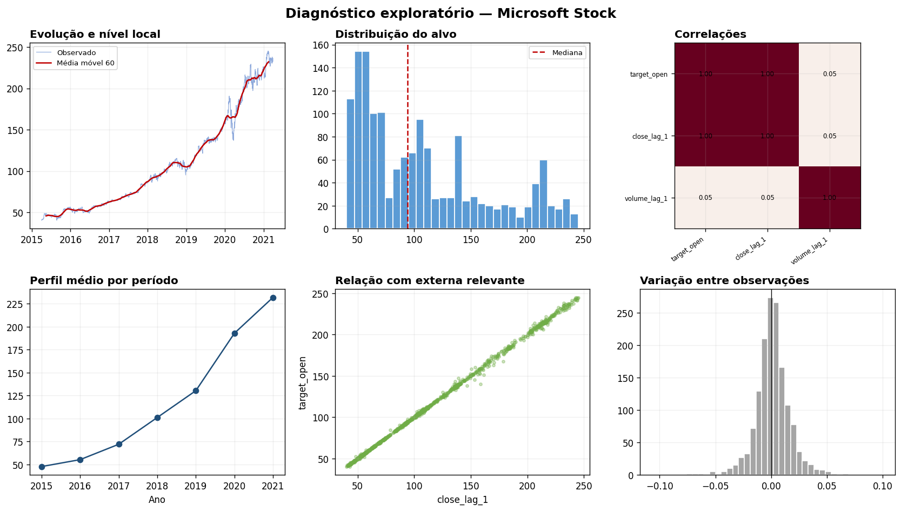

*Microsoft: diagnóstico exploratório*

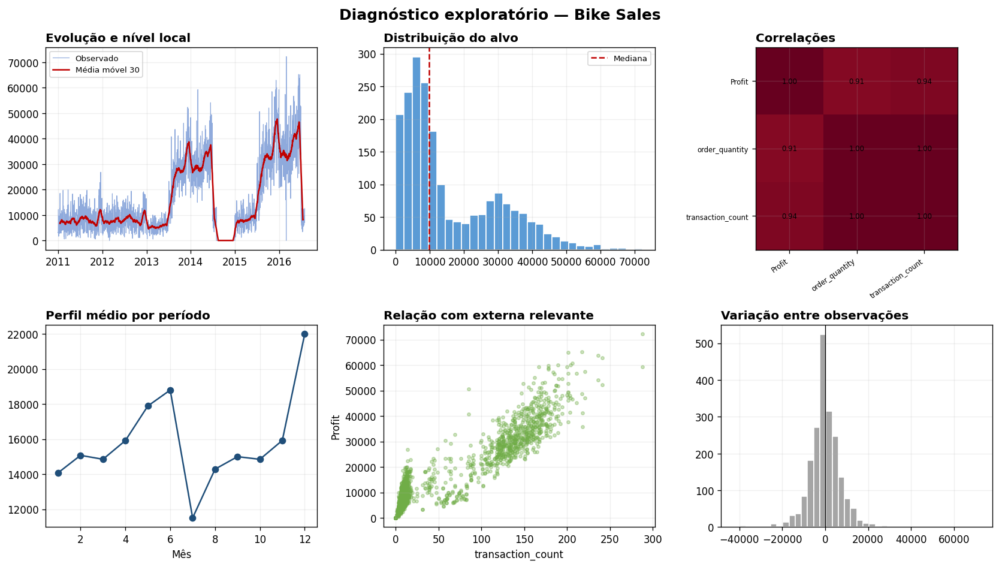

*Sales: diagnóstico exploratório*

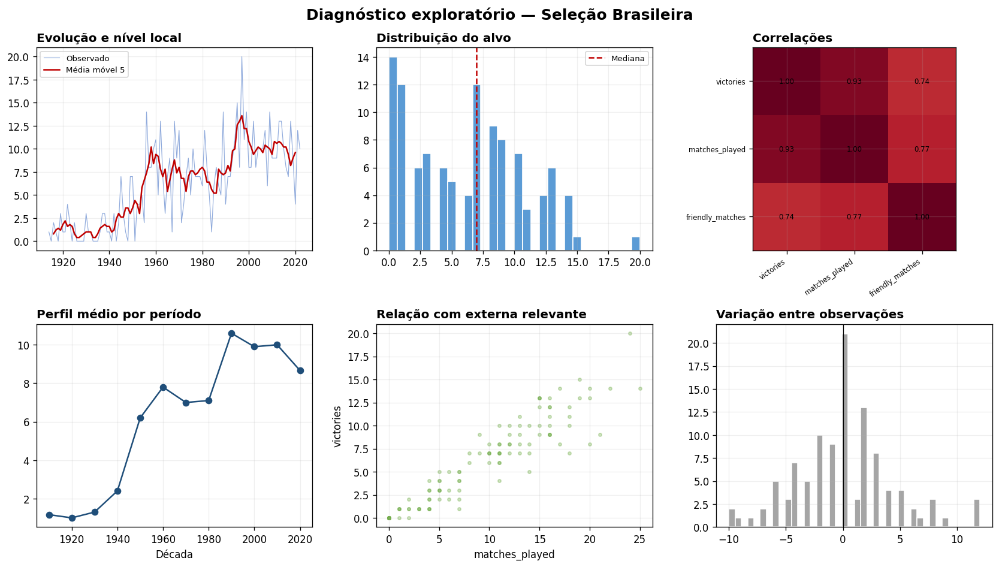

*Brasil: diagnóstico exploratório*

## 4. Limpeza, preparação e Feature Engineering

### Qualidade dos dados e decisões de limpeza

*Auditoria das bases preparadas*

| base | ausentes | datas duplicadas | intervalos distintos entre datas | outliers IQR do alvo |
| --- | --- | --- | --- | --- |
| Delhi | 0 | 0 | 1 | 0 |
| Pilgrim's Pride | 0 | 0 | 6 | 161 |
| Microsoft | 0 | 0 | 4 | 0 |
| Sales | 0 | 0 | 1 | 9 |
| Brasil | 0 | 0 | 2 | 1 |

Outliers do alvo são contados, não removidos: em preço e clima o ponto extremo costuma ser o evento real que mais importa prever. Em séries com tendência, como as ações, o critério IQR global marca como atípicos níveis apenas novos, por isso serve só como triagem. Os intervalos irregulares das ações são fins de semana e feriados: as sessões são mantidas como observadas, sem inventar preços.

*Decisões de limpeza e transformação (prepare_bases.ipynb)*

| Base | Situação | Decisão | Justificativa |
| --- | --- | --- | --- |
| Delhi Climate | Sobreposição em 01/01/2017 | Manter o valor do teste | Regra explícita de precedência |
| Delhi Climate | Lacunas diárias | Preenchimento para frente | Usa somente informação passada |
| Pilgrim's Pride | Dias sem pregão | Não preencher | Não representam negociações ausentes |
| Seleção Brasileira | Registro de 05/09/2021 sem resultado | Excluir | Não possui desfecho utilizável |
| Seleção Brasileira | Anos sem partidas | Preencher com zero | Mantém a frequência anual |
| Bike Sales | Várias transações na mesma data | Agregar por dia | As linhas representam transações |
| Bike Sales | Dias sem registros | Preencher com zero | Mantém a frequência diária; ago-dez/2014 não tem nenhum registro na fonte (lacuna de dados, documentada como limitação) |
| Bike Sales | 1.000 linhas idênticas na fonte | Manter e somar | Sem identificador de transação, não há como provar duplicação; documentado como limitação |
| Microsoft Stock | Primeira linha sem valores anteriores | Excluir | Não é possível calcular os lags |
| Microsoft Stock | Dias sem pregão | Não preencher | Não criar preços artificiais |

*Checagens de consistência específicas de cada base*

| Base | Verificação | Ocorrências | Interpretação |
| --- | --- | --- | --- |
| Delhi Climate | Umidade fora de 0% a 100% | 0 | Revisar se maior que zero |
| Delhi Climate | Velocidade do vento negativa | 0 | Deve ser zero |
| Delhi Climate | Pressão fora de 870 a 1.100 hPa | 8 | Possíveis erros de medição/registro |
| Pilgrim's Pride | High menor que Open/Close | 0 | Deve ser zero |
| Pilgrim's Pride | Low maior que Open/Close | 0 | Deve ser zero |
| Pilgrim's Pride | Sessões com volume zero | 10 | Investigar, mas não excluir automaticamente |
| Seleção Brasileira | Vitórias maiores que partidas | 0 | Deve ser zero |
| Seleção Brasileira | Amistosos maiores que partidas | 0 | Deve ser zero |
| Seleção Brasileira | Anos sem partidas registradas | 12 | Cobertura histórica incompleta |
| Bike Sales | Dias com lucro zero | 155 | Compatível com dias sem vendas |
| Bike Sales | Lucro positivo sem transações | 0 | Deve ser zero |
| Microsoft Stock | Preços de abertura não positivos | 0 | Deve ser zero |
| Microsoft Stock | Volumes anteriores negativos | 0 | Deve ser zero |

**Alertas que afetam a modelagem.** Em Delhi, 8 registros de pressão estão fora da faixa física de 870 a 1.100 hPa; eles foram mantidos na base e tratados apenas no PLS e no Kalman, por winsorização das externas aprendida no treino de cada origem. O SARIMAX usa as externas sem tratamento. Em Sales, a fonte não tem nenhuma transação entre 01/08/2014 e 31/12/2014 (153 dias). Como a preparação preenche dias sem registro com zero, esse intervalo virou lucro zero: 119 dias no fim da validação e 34 no início do teste. O padrão (dados só de janeiro a julho) se repete em 2016, o que indica ausência de dados e não ausência de vendas. A fonte também contém 1.000 linhas idênticas em todas as colunas; sem identificador de transação, não há como provar que são duplicações, e a preparação as soma como transações. As duas situações foram mantidas para não alterar a base congelada e estão discutidas nas limitações.

### Feature Engineering

Random Forest e PLS recebem a mesma tabela de features. A regra é única: uma linha com data t só usa informação de até t − h. Lags do alvo em {h, h+1, h+2, h+3, m, m+h}, filtrados para lag ≥ h; média e desvio móveis em janelas de 4, 8 e 12 calculados depois de `shift(h)`; `delta_nivel` = média de 4 − média de 12; calendário (mês, dia da semana, semana) com codificação seno/cosseno. Externas conhecidas na origem entram com o valor da própria data; externas observadas só depois entram defasadas em h. As primeiras linhas, sem histórico suficiente para os lags, são descartadas (`dropna`), e colunas constantes, como o calendário da série anual do Brasil, são removidas.

*Tamanho da tabela de features*

| base | features (RF e PLS) | features no PLS | removidas no PLS (combinação linear exata) |
| --- | --- | --- | --- |
| Delhi | 25 | 23 | media_4, delta_nivel |
| Pilgrim's Pride | 22 | 20 | media_4, delta_nivel |
| Microsoft | 24 | 22 | media_4, delta_nivel |
| Sales | 23 | 21 | media_4, delta_nivel |
| Brasil | 20 | 17 | media_4, delta_nivel, semana_cos |

### Disponibilidade e seleção das variáveis externas

Cada externa foi avaliada na versão que realmente entra no modelo (já defasada): correlação de Pearson com o alvo e VIF entre as externas, com poda iterativa da de maior VIF até todas ficarem abaixo de 10.

*Disponibilidade, correlação e colinearidade das externas*

| base | exogena | papel | disponivel_na_origem | como_entra | r | p_valor | significativa | VIF | decisao |
| --- | --- | --- | --- | --- | --- | --- | --- | --- | --- |
| Brasil | friendly_matches_lag_1 | defasada | nao | defasada em h | 0,393 | 0,0004 | sim | 2,7 | mantida |
| Brasil | matches_played_lag_1 | defasada | nao | defasada em h | 0,375 | 0,0008 | sim | 2,7 | mantida |
| Delhi | humidity_lag_7 | defasada | nao | defasada em h | -0,533 | 0,0000 | sim | 1,3 | mantida |
| Delhi | meanpressure_lag_7 | defasada | nao | defasada em h | -0,844 | 0,0000 | sim | 1,2 | mantida |
| Delhi | wind_speed_lag_7 | defasada | nao | defasada em h | 0,333 | 0,0000 | sim | 1,2 | mantida |
| Microsoft | close_lag_1 | conhecida | sim | valor da propria data | 1,000 | 0,0000 | sim | 1,0 | mantida |
| Microsoft | volume_lag_1 | conhecida | sim | valor da propria data | -0,111 | 0,0003 | sim | 1,0 | mantida |
| Pilgrim's Pride | Low_lag_5 | defasada | nao | defasada em h | 0,995 | 0,0000 | sim | 1,1 | mantida |
| Pilgrim's Pride | Volume_lag_5 | defasada | nao | defasada em h | 0,294 | 0,0000 | sim | 1,1 | mantida |
| Pilgrim's Pride | High_lag_5 | defasada | nao | defasada em h | 0,995 | 0,0000 | sim | 1.134,6 | removida |
| Pilgrim's Pride | Open_lag_5 | defasada | nao | defasada em h | 0,995 | 0,0000 | sim | 2.038,8 | removida |
| Sales | transaction_count_lag_7 | defasada | nao | defasada em h | 0,849 | 0,0000 | sim | 1,0 | mantida |
| Sales | order_quantity_lag_7 | defasada | nao | defasada em h | 0,837 | 0,0000 | sim | 108,9 | removida |

## 5. STL, tendência e força da sazonalidade

A STL é calculada sobre treino + validação, sem tocar no teste. A força da sazonalidade é 1 − Var(resíduo) / Var(sazonal + resíduo): perto de 1 o ciclo domina, perto de 0 é ruído. O período m usado pelos modelos é o de maior força até 30, limite computacional do SARIMAX; ciclos mais longos ficam a cargo das features de calendário. Com força abaixo de 0,05, a série é tratada como não sazonal (m = 1) e a STL do gráfico usa o período de maior força só para visualização.

*Período sazonal e decomposição*

| base | m usado | força sazonal em m | m de maior força | % variância sazonal (STL) | % variância residual (STL) |
| --- | --- | --- | --- | --- | --- |
| Delhi | 30 | 0,271 | 365 | 2,0 | 5,1 |
| Pilgrim's Pride | 1 | -0,006 | 52 | 0,5 | 1,4 |
| Microsoft | 30 | 0,201 | 252 | 0,2 | 0,4 |
| Sales | 12 | 0,156 | 12 | 4,2 | 12,9 |
| Brasil | 4 | 0,345 | 4 | 21,5 | 27,8 |

A tendência de Delhi tem 8 fases (3 de alta, 5 de queda, 0 de estabilidade); a maior alta vai de 2015-01-13 a 2015-05-29 (20,91 no nível); a maior queda vai de 2014-06-23 a 2015-01-08 (-21,32). Houve 7 mudanças de direção classificadas. A força sazonal em m = 30 é 0,271; o período de maior força é m = 365. O resíduo da STL responde por 5,1% da variância da série. Como m = 30, o ciclo anual não cabe no componente sazonal e aparece na tendência: as fases de alta e queda de Delhi são, na prática, as estações do ano.

A tendência de Pilgrim's Pride tem 7 fases (4 de alta, 2 de queda, 1 de estabilidade); a maior alta vai de 2003-02-18 a 2005-05-11 (17,81 no nível); a maior queda vai de 2007-06-22 a 2009-04-02 (-21,67). Houve 6 mudanças de direção classificadas. Não há sazonalidade útil (m = 1; força máxima -0,006); o período de maior força é m = 52. O resíduo da STL responde por 1,4% da variância da série.

A tendência de Microsoft tem 5 fases (3 de alta, 2 de queda, 0 de estabilidade); a maior alta vai de 2016-06-06 a 2018-09-21 (59,33 no nível); a maior queda vai de 2018-10-02 a 2019-01-02 (-4,63). Houve 4 mudanças de direção classificadas. A força sazonal em m = 30 é 0,201; o período de maior força é m = 252. O resíduo da STL responde por 0,4% da variância da série.

A tendência de Sales tem 6 fases (2 de alta, 1 de queda, 3 de estabilidade); a maior alta vai de 2013-06-03 a 2013-09-23 (21.001,02 no nível); a maior queda vai de 2014-05-30 a 2014-08-31 (-34.823,59). Houve 5 mudanças de direção classificadas. A força sazonal em m = 12 é 0,156. O resíduo da STL responde por 12,9% da variância da série. A maior queda coincide com a lacuna de dados de 2014 (seção 4), e não com uma queda real de vendas.

A tendência de Brasil tem 11 fases (7 de alta, 4 de queda, 0 de estabilidade); a maior alta vai de 1953-01-01 a 1962-01-01 (6,41 no nível); a maior queda vai de 1963-01-01 a 1967-01-01 (-3,24). Houve 10 mudanças de direção classificadas. A força sazonal em m = 4 é 0,345. O resíduo da STL responde por 27,8% da variância da série.

Leitura por base: Delhi tem ciclo anual muito forte (força próxima de 1 em m = 365) que o SARIMAX não comporta, então m = 30 captura só parte dele e o restante fica no calendário; Pilgrim's e Microsoft são dominadas pela tendência, com sazonalidade fraca; Sales combina crescimento com forte ruído diário; no Brasil, o ciclo de 4 anos da Copa do Mundo é o mais forte.

*Fases da tendência (inclinação normalizada; fases curtas absorvidas)*

| base | fase | inicio | fim | pontos | variacao | variacao_pct |
| --- | --- | --- | --- | --- | --- | --- |
| Delhi | alta | 2013-01-24 | 2013-05-26 | 123 | 19,81 | 143,4 |
| Delhi | queda | 2013-06-06 | 2013-08-06 | 62 | -3,76 | -11,2 |
| Delhi | queda | 2013-09-06 | 2014-01-08 | 125 | -16,74 | -55,6 |
| Delhi | alta | 2014-01-19 | 2014-06-12 | 145 | 20,18 | 145,8 |
| Delhi | queda | 2014-06-23 | 2015-01-08 | 200 | -21,32 | -63,0 |
| Delhi | alta | 2015-01-13 | 2015-05-29 | 137 | 20,91 | 165,8 |
| Delhi | queda | 2015-06-09 | 2015-07-29 | 51 | -3,33 | -10,0 |
| Delhi | queda | 2015-09-07 | 2015-12-18 | 103 | -16,05 | -51,6 |
| Pilgrim's Pride | estavel | 1990-05-23 | 1995-05-11 | 1.257 | 0,05 | 1,7 |
| Pilgrim's Pride | alta | 1996-06-25 | 1998-12-07 | 620 | 6,06 | 194,8 |
| Pilgrim's Pride | queda | 1999-01-25 | 2000-04-24 | 316 | -4,14 | -47,0 |
| Pilgrim's Pride | alta | 2000-08-09 | 2001-11-23 | 323 | 4,09 | 92,5 |
| Pilgrim's Pride | alta | 2003-02-18 | 2005-05-11 | 563 | 17,81 | 362,9 |
| Pilgrim's Pride | queda | 2007-06-22 | 2009-04-02 | 449 | -21,67 | -94,2 |
| Pilgrim's Pride | alta | 2012-03-29 | 2014-07-15 | 576 | 13,38 | 306,6 |
| Microsoft | queda | 2015-06-12 | 2015-08-28 | 55 | -1,65 | -3,6 |
| Microsoft | alta | 2015-09-09 | 2015-12-10 | 66 | 10,45 | 23,6 |
| Microsoft | alta | 2016-06-06 | 2018-09-21 | 580 | 59,33 | 116,0 |
| Microsoft | queda | 2018-10-02 | 2019-01-02 | 63 | -4,63 | -4,2 |
| Microsoft | alta | 2019-01-09 | 2019-05-15 | 88 | 20,07 | 19,0 |
| Sales | estavel | 2011-01-01 | 2011-03-14 | 73 | 1.337,93 | 21,8 |
| Sales | estavel | 2013-01-29 | 2013-06-02 | 125 | 1.730,59 | 37,2 |
| Sales | alta | 2013-06-03 | 2013-09-23 | 113 | 21.001,02 | 329,6 |
| Sales | alta | 2014-03-20 | 2014-05-27 | 69 | 8.752,21 | 33,2 |
| Sales | queda | 2014-05-30 | 2014-08-31 | 94 | -34.823,59 | -99,9 |
| Sales | estavel | 2014-09-01 | 2014-11-27 | 88 | -21,41 | -99,9 |
| Brasil | alta | 1916-01-01 | 1921-01-01 | 6 | 0,84 | 82,9 |
| Brasil | queda | 1923-01-01 | 1927-01-01 | 5 | -1,27 | -76,7 |
| Brasil | alta | 1928-01-01 | 1930-01-01 | 3 | 0,54 | 110,7 |
| Brasil | alta | 1935-01-01 | 1939-01-01 | 5 | 1,22 | 158,9 |
| Brasil | alta | 1942-01-01 | 1950-01-01 | 9 | 1,73 | 80,7 |
| Brasil | alta | 1953-01-01 | 1962-01-01 | 10 | 6,41 | 171,4 |
| Brasil | queda | 1963-01-01 | 1967-01-01 | 5 | -3,24 | -34,2 |
| Brasil | queda | 1971-01-01 | 1974-01-01 | 4 | -0,50 | -7,5 |
| Brasil | alta | 1977-01-01 | 1980-01-01 | 4 | 1,42 | 22,7 |
| Brasil | queda | 1981-01-01 | 1984-01-01 | 4 | -1,72 | -22,5 |
| Brasil | alta | 1985-01-01 | 1988-01-01 | 4 | 2,40 | 39,6 |

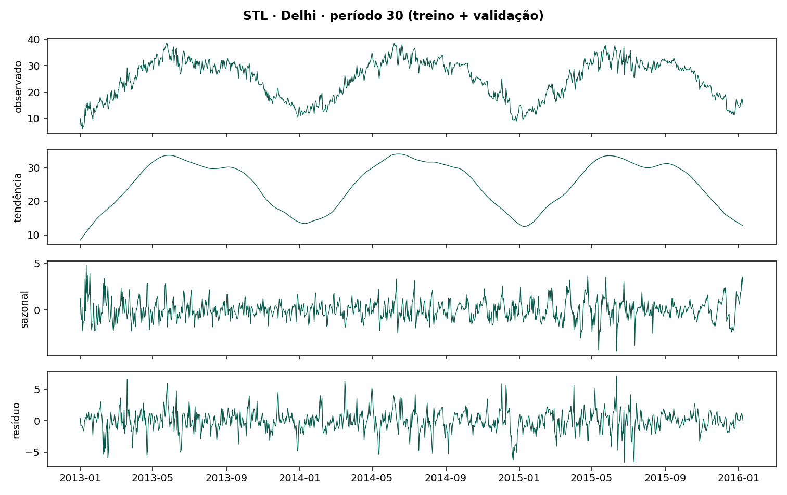

*Delhi: decomposição STL*

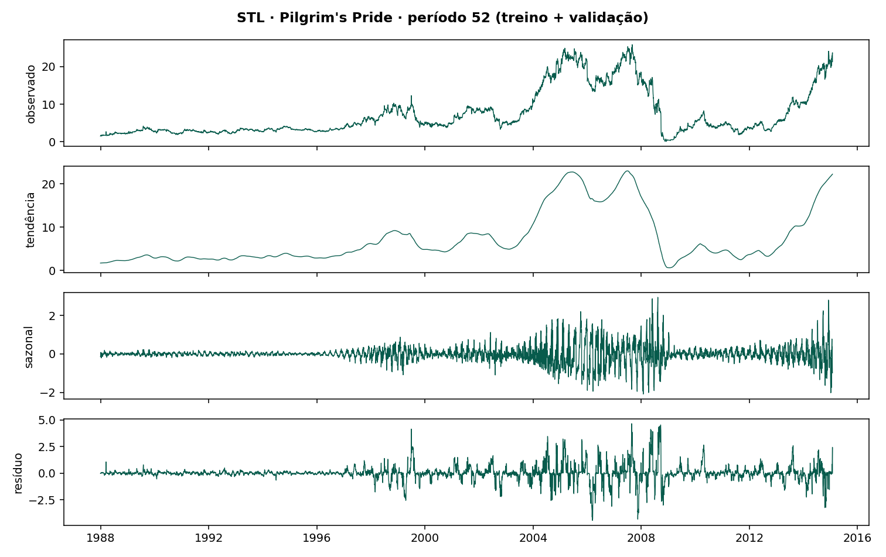

*Pilgrim's Pride: decomposição STL*

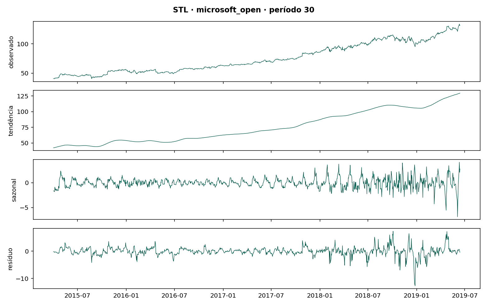

*Microsoft: decomposição STL*

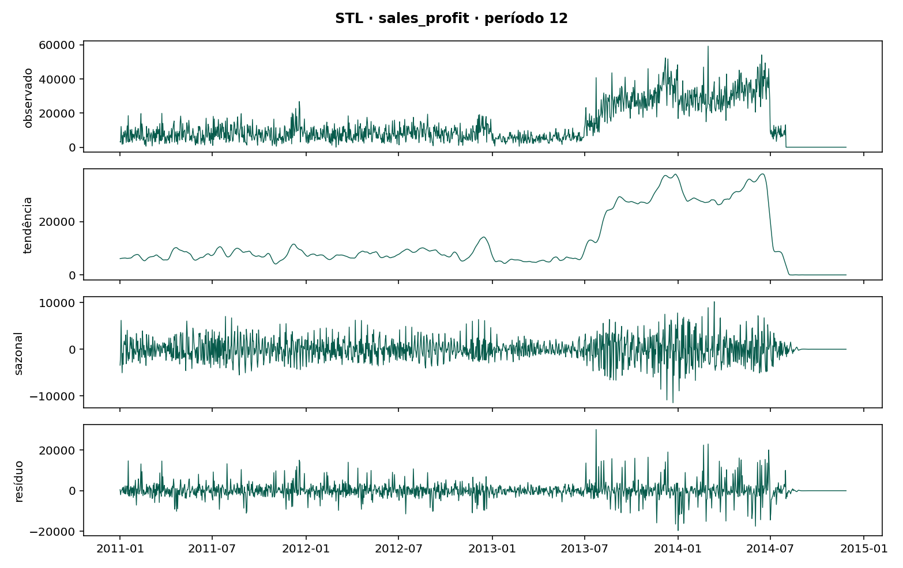

*Sales: decomposição STL*

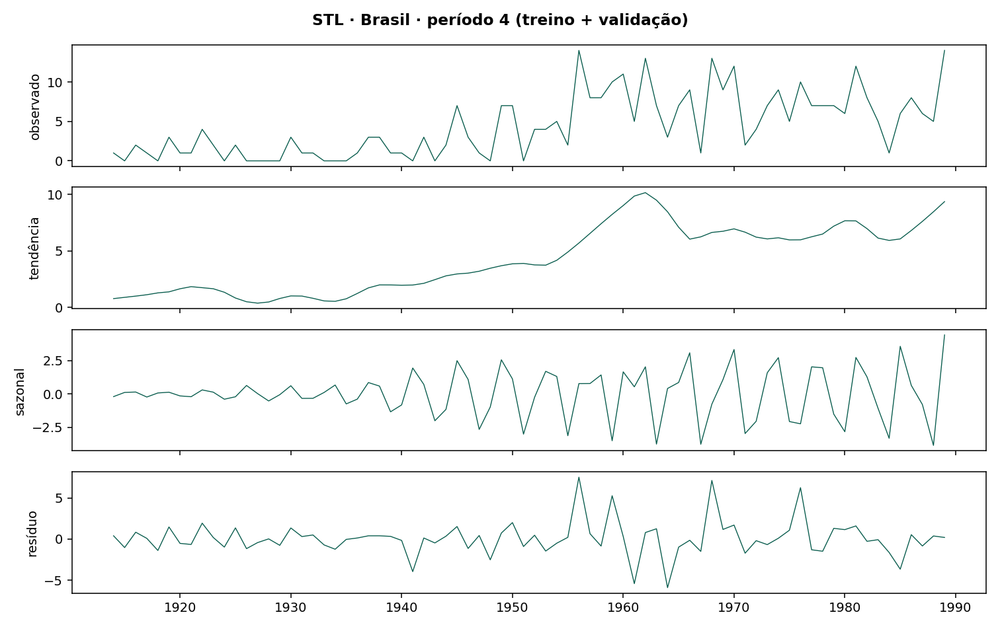

*Brasil: decomposição STL*

## 6. Protocolo walk-forward

O corte é cronológico: os 30% finais da série são o teste e, dentro dos 70% anteriores, os 30% finais são a validação. Em cada origem, o modelo é ajustado só com o passado, prevê as h datas seguintes, e a origem avança h passos, incorporando os valores observados. Como o passo é igual a h, os blocos de previsão não se sobrepõem e cada data do teste é prevista uma única vez por modelo.

A validação usa no máximo 30 origens espaçadas pela janela, porque cada combinação de hiperparâmetros custa um walk-forward inteiro; o teste usa todas as origens. Os hiperparâmetros são congelados antes do teste, e os quatro modelos recebem exatamente as mesmas origens (conferido abaixo).

*Cortes treino / validação / teste*

| base | obs | h | treino | validação | teste |
| --- | --- | --- | --- | --- | --- |
| Delhi | 1.575 | 7 | 772 | 331 | 472 |
| Pilgrim's Pride | 9.751 | 5 | 4.778 | 2.048 | 2.925 |
| Microsoft | 1.510 | 1 | 740 | 317 | 453 |
| Sales | 2.039 | 7 | 999 | 428 | 612 |
| Brasil | 109 | 1 | 53 | 23 | 33 |

*Número de origens de teste por modelo (iguais em cada base)*

| base | Holt-Winters | PLS | Random Forest | SARIMAX |
| --- | --- | --- | --- | --- |
| Brasil | 33 | 33 | 33 | 33 |
| Delhi | 67 | 67 | 67 | 67 |
| Microsoft | 453 | 453 | 453 | 453 |
| Pilgrim's Pride | 585 | 585 | 585 | 585 |
| Sales | 87 | 87 | 87 | 87 |

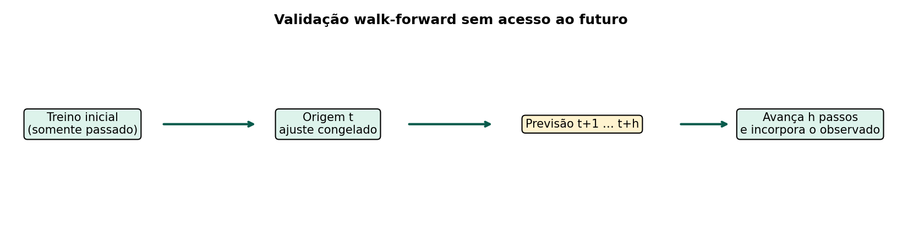

*Esquema do walk-forward*

## 7. Modelos, hiperparâmetros e otimização

Toda a seleção usa somente treino e validação. SARIMAX: `d` e `D` vêm dos testes ADF e KPSS (só se considera a série estacionária quando os dois concordam), `m` vem da STL, e a grade cobre p, q, P, Q de 0 a 2 e d, D até o sugerido. Como AIC/BIC medem ajuste dentro da amostra e o MAE mede erro fora dela, a decisão é em duas etapas: BIC na grade inteira e MAE de validação nas 10 melhores por BIC; vence a menor soma de BIC e MAE normalizados. Holt-Winters: grade de tendência (aditiva ou ausente), sazonalidade (aditiva, multiplicativa ou ausente) e amortecimento, decidida pelo MAE de validação; os parâmetros de suavização são estimados por máxima verossimilhança. Random Forest: busca aleatória de 16 das 48 combinações de n_estimators, max_depth, max_features, min_samples_split e min_samples_leaf. PLS: grade exaustiva de n_components de 1 até o posto de X (seção 11).

*Espaço de busca*

| modelo | espaço de busca | procedimento | critério |
| --- | --- | --- | --- |
| SARIMAX | p, q, P, Q ∈ {0,1,2}; d ≤ d sugerido; D ≤ D sugerido; m da STL; externas após VIF | grade completa + top 10 por BIC | BIC + MAE de validação normalizados |
| Holt-Winters | tendência {add, nenhuma}; sazonal {add, mul, nenhuma}; amortecida {sim, não} | grade completa | MAE de validação |
| Random Forest | n_estimators {300, 600}; max_depth {None, 6, 12}; max_features {sqrt, 0,5}; min_samples_split {2, 5}; min_samples_leaf {1, 2} | 16 sorteios (random_state = 42) | MAE de validação |
| PLS | n_components de 1 até min(30, posto de X, menor treino − 1) | grade completa | MAE de validação |

*Estacionariedade e ordens de diferenciação*

| base | ADF p-valor (nível) | KPSS p-valor (nível) | estacionaria | d | D | m |
| --- | --- | --- | --- | --- | --- | --- |
| Delhi | 0,2829 | 0,1000 | não | 1 | 0 | 30 |
| Pilgrim's Pride | 0,7925 | 0,0100 | não | 1 | 0 | 1 |
| Microsoft | 0,9951 | 0,0100 | não | 1 | 0 | 30 |
| Sales | 0,4107 | 0,0100 | não | 1 | 0 | 12 |
| Brasil | 0,7112 | 0,0100 | não | 1 | 0 | 4 |

*Configuração final de cada combinação (tempo = otimização + walk-forward de teste)*

| base | modelo | configuração escolhida | candidatos avaliados | MAE de validação | AIC | BIC | tempo (s) |
| --- | --- | --- | --- | --- | --- | --- | --- |
| Brasil | Holt-Winters | {'trend': None, 'seasonal': 'add', 'damped': False} | 9 | 2,662 | — | — | 0,7 |
| Brasil | PLS | {'n_components': 1} | 17 | 2,837 | — | — | 1,0 |
| Brasil | Random Forest | {'n_estimators': 300, 'max_depth': 12, 'max_features': 'sqrt', 'min_samples_split': 2, 'min_samples_leaf': 1} | 16 | 2,875 | — | — | 16,2 |
| Brasil | SARIMAX | {'order': (0, 1, 2), 'seasonal_order': (0, 0, 2, 4)} | 10 | 2,973 | 336,3 | 351,4 | 2,7 |
| Delhi | Holt-Winters | {'trend': 'add', 'seasonal': None, 'damped': True} | 9 | 2,010 | — | — | 9,7 |
| Delhi | PLS | {'n_components': 20} | 23 | 1,916 | — | — | 3,2 |
| Delhi | Random Forest | {'n_estimators': 600, 'max_depth': None, 'max_features': 'sqrt', 'min_samples_split': 5, 'min_samples_leaf': 2} | 16 | 1,668 | — | — | 146,9 |
| Delhi | SARIMAX | {'order': (1, 1, 2), 'seasonal_order': (0, 0, 2, 30)} | 10 | 1,888 | 3.929,7 | 3.974,2 | 4.848,6 |
| Microsoft | Holt-Winters | {'trend': 'add', 'seasonal': 'mul', 'damped': False} | 9 | 1,295 | — | — | 81,1 |
| Microsoft | PLS | {'n_components': 13} | 22 | 1,195 | — | — | 4,0 |
| Microsoft | Random Forest | {'n_estimators': 300, 'max_depth': 12, 'max_features': 0.5, 'min_samples_split': 5, 'min_samples_leaf': 1} | 16 | 1,226 | — | — | 425,4 |
| Microsoft | SARIMAX | {'order': (0, 0, 0), 'seasonal_order': (2, 0, 0, 30)} | 10 | 0,734 | 2.145,9 | 2.170,5 | 1.142,4 |
| Pilgrim's Pride | Holt-Winters | {'trend': None, 'seasonal': None, 'damped': False} | 3 | 0,308 | — | — | 6,1 |
| Pilgrim's Pride | PLS | {'n_components': 19} | 20 | 0,497 | — | — | 13,7 |
| Pilgrim's Pride | Random Forest | {'n_estimators': 300, 'max_depth': None, 'max_features': 'sqrt', 'min_samples_split': 5, 'min_samples_leaf': 1} | 16 | 0,497 | — | — | 2.414,5 |
| Pilgrim's Pride | SARIMAX | {'order': (1, 1, 0), 'seasonal_order': (0, 0, 0, 0)} | 10 | 0,306 | 722,2 | 749,5 | 262,6 |
| Sales | Holt-Winters | {'trend': None, 'seasonal': None, 'damped': False} | 9 | 4.081,372 | — | — | 3,6 |
| Sales | PLS | {'n_components': 5} | 21 | 4.791,286 | — | — | 2,8 |
| Sales | Random Forest | {'n_estimators': 600, 'max_depth': 12, 'max_features': 'sqrt', 'min_samples_split': 5, 'min_samples_leaf': 1} | 16 | 4.079,100 | — | — | 174,8 |
| Sales | SARIMAX | {'order': (0, 1, 2), 'seasonal_order': (0, 0, 2, 12)} | 10 | 4.100,256 | 27.723,4 | 27.754,8 | 162,9 |

No SARIMAX, o número de candidatos é o das 10 melhores por BIC, que passam pelo MAE de validação; a grade inteira está em `resultados/busca.csv` e `resultados/cache_sarimax_*`. Os parâmetros de suavização do Holt-Winters, estimados no fim do treino com a configuração congelada, mostram quão rápido cada componente reage ao dado novo (perto de 1 = reage quase só ao último valor).

*Holt-Winters: forma escolhida e parâmetros de suavização*

| base | trend | seasonal | damped | m | alpha_nivel | beta_tendencia | gamma_sazonal | phi_amortecimento |
| --- | --- | --- | --- | --- | --- | --- | --- | --- |
| Delhi | add | — | sim | 30 | 0,765 | 0,000 | — | 0,987 |
| Pilgrim's Pride | — | — | não | 1 | 1,000 | — | — | — |
| Microsoft | add | mul | não | 30 | 1,000 | 0,000 | 8,91e-09 | — |
| Sales | — | — | não | 12 | 0,199 | — | — | — |
| Brasil | — | add | não | 4 | 0,204 | — | 0,000 | — |

## 8. Resultados comparativos por MAE

O MAE é calculado sobre todas as previsões fora da amostra do teste. Como as bases têm escalas diferentes, o MAE não é somado nem promediado entre bases: compara-se a posição dentro de cada base. A coluna de ganho compara cada modelo com a previsão ingênua (último valor observado na origem), calculada nas mesmas origens.

*MAE de teste e posição dentro de cada base*

| base | modelo | posição | MAE | MAE ingênuo | ganho sobre o ingênuo (%) | previsões |
| --- | --- | --- | --- | --- | --- | --- |
| Brasil | Holt-Winters | 1 | 2,645 | 3,818 | 30,7 | 33 |
| Brasil | PLS | 2 | 2,677 | 3,818 | 29,9 | 33 |
| Brasil | SARIMAX | 3 | 2,859 | 3,818 | 25,1 | 33 |
| Brasil | Random Forest | 4 | 2,905 | 3,818 | 23,9 | 33 |
| Delhi | Holt-Winters | 1 | 1,885 | 1,944 | 3,1 | 469 |
| Delhi | PLS | 2 | 1,981 | 1,944 | -1,9 | 469 |
| Delhi | Random Forest | 3 | 2,021 | 1,944 | -4,0 | 469 |
| Delhi | SARIMAX | 4 | 2,026 | 1,944 | -4,2 | 469 |
| Microsoft | SARIMAX | 1 | 1,503 | 2,542 | 40,9 | 453 |
| Microsoft | Random Forest | 2 | 2,321 | 2,542 | 8,7 | 453 |
| Microsoft | PLS | 3 | 2,495 | 2,542 | 1,8 | 453 |
| Microsoft | Holt-Winters | 4 | 2,616 | 2,542 | -2,9 | 453 |
| Pilgrim's Pride | Holt-Winters | 1 | 0,616 | 0,616 | 3,47e-08 | 2.925 |
| Pilgrim's Pride | SARIMAX | 2 | 0,617 | 0,616 | -0,2 | 2.925 |
| Pilgrim's Pride | PLS | 3 | 0,829 | 0,616 | -34,6 | 2.925 |
| Pilgrim's Pride | Random Forest | 4 | 0,862 | 0,616 | -39,8 | 2.925 |
| Sales | Random Forest | 1 | 5.479,244 | 7.325,654 | 25,2 | 609 |
| Sales | Holt-Winters | 2 | 5.686,698 | 7.325,654 | 22,4 | 609 |
| Sales | SARIMAX | 3 | 5.720,228 | 7.325,654 | 21,9 | 609 |
| Sales | PLS | 4 | 5.974,187 | 7.325,654 | 18,4 | 609 |

*Vitórias e posição média*

| modelo | vitórias | posição média | melhor posição | pior posição |
| --- | --- | --- | --- | --- |
| Holt-Winters | 3 | 1,8 | 1 | 4 |
| SARIMAX | 1 | 2,6 | 1 | 4 |
| Random Forest | 1 | 2,8 | 1 | 4 |
| PLS | 0 | 2,8 | 2 | 4 |

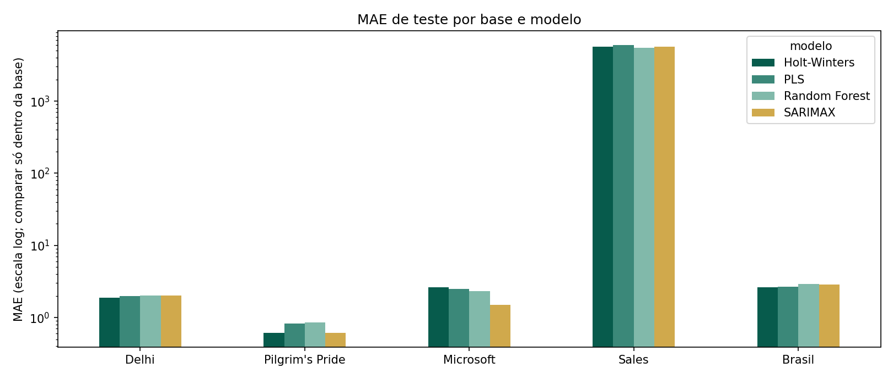

*MAE por base (escala log)*

### Desempenho e características das bases

**Delhi** — série suave com ciclo anual forte e h = 7, em que o nível recente e o calendário explicam quase tudo. Ordem: Holt-Winters (1,885) < PLS (1,981) < Random Forest (2,021) < SARIMAX (2,026). Holt-Winters vence com vantagem de 5,1% sobre o 2º colocado e 3,1% sobre o ingênuo. Superam o ingênuo em mais de 0,5%: Holt-Winters.

**Pilgrim's Pride** — preço com tendência e mudanças de nível, sem sazonalidade útil e próximo de um passeio aleatório. Ordem: Holt-Winters (0,616) < SARIMAX (0,617) < PLS (0,829) < Random Forest (0,862). Holt-Winters vence com vantagem de 0,2% sobre o 2º colocado e praticamente o mesmo MAE do ingênuo. Nenhum modelo supera o ingênuo em mais de 0,5%: a série se comporta quase como um passeio aleatório.

**Microsoft** — abertura quase igual ao fechamento da sessão anterior, uma externa conhecida na origem. Ordem: SARIMAX (1,503) < Random Forest (2,321) < PLS (2,495) < Holt-Winters (2,616). SARIMAX vence com vantagem de 54,5% sobre o 2º colocado e 40,9% sobre o ingênuo. Superam o ingênuo em mais de 0,5%: SARIMAX, Random Forest e PLS.

**Sales** — lucro diário muito ruidoso, com crescimento, dias zerados e a lacuna de 2014. Ordem: Random Forest (5.479,244) < Holt-Winters (5.686,698) < SARIMAX (5.720,228) < PLS (5.974,187). Random Forest vence com vantagem de 3,8% sobre o 2º colocado e 25,2% sobre o ingênuo. Superam o ingênuo em mais de 0,5%: Random Forest, Holt-Winters, SARIMAX e PLS.

**Brasil** — contagem anual curta (109 anos), com muito ruído e ciclo fraco de Copa do Mundo. Ordem: Holt-Winters (2,645) < PLS (2,677) < SARIMAX (2,859) < Random Forest (2,905). Holt-Winters vence com vantagem de 1,2% sobre o 2º colocado e 30,7% sobre o ingênuo. Superam o ingênuo em mais de 0,5%: Holt-Winters, PLS, SARIMAX e Random Forest.

Padrões gerais: modelos que recebem as externas conhecidas na origem se destacam em Microsoft, onde o fechamento anterior é quase toda a informação; o Holt-Winters, univariado, é forte onde o alvo se parece com um passeio aleatório ou tem pouco sinal externo; o Random Forest tira proveito das relações não lineares e dos extremos de Sales; o PLS fica entre os melhores quando as features são numerosas e colineares, mas não acompanha níveis de preço fora da faixa do treino.

## 9. Análise dos resíduos e teste de Ljung-Box

Resíduo = observado − previsto, calculado fora da amostra. O teste de Ljung-Box tem como hipótese nula a ausência de autocorrelação até o lag avaliado: p > 0,05 significa não haver evidência de padrão remanescente, não prova de independência.

Há um cuidado metodológico para h > 1 (Delhi, Pilgrim's e Sales): os h erros de uma mesma origem são previsões feitas com a mesma informação e, por isso, correlacionados entre si por construção. A série agregada (passos 1 a h em ordem de data) tende a rejeitar ruído branco mesmo quando cada horizonte isolado não tem padrão. Por isso o teste é apresentado das duas formas: agregado, como pedido, e por passo de previsão, que é a leitura correta quando h > 1.

*Ljung-Box agregado e por passo de previsão (20 combinações oficiais)*

| base | modelo | n | lags | viés (média) | desvio | estatística LB | p-valor agregado | ruído branco (agregado) | passos | passos com p ≤ 0,05 | menor p por passo |
| --- | --- | --- | --- | --- | --- | --- | --- | --- | --- | --- | --- |
| Brasil | Holt-Winters | 33 | 6 | 0,133 | 3,587 | 7,5 | 0,2788 | sim | 1 | 0 | 0,2788 |
| Brasil | PLS | 33 | 6 | 1,035 | 3,504 | 7,8 | 0,2559 | sim | 1 | 0 | 0,2559 |
| Brasil | Random Forest | 33 | 6 | 1,165 | 3,834 | 8,6 | 0,1955 | sim | 1 | 0 | 0,1955 |
| Brasil | SARIMAX | 33 | 6 | 0,122 | 3,595 | 15,8 | 0,0148 | não | 1 | 1 | 0,0148 |
| Delhi | Holt-Winters | 469 | 10 | 0,002 | 2,503 | 293,9 | 3,02e-57 | não | 7 | 2 | 0,0046 |
| Delhi | PLS | 469 | 10 | 0,495 | 2,469 | 519,5 | 3,05e-105 | não | 7 | 1 | 0,0142 |
| Delhi | Random Forest | 469 | 10 | 0,953 | 2,315 | 425,8 | 3,06e-85 | não | 7 | 0 | 0,1032 |
| Delhi | SARIMAX | 469 | 10 | -0,090 | 5,065 | 6,5 | 0,7737 | sim | 7 | 2 | 0,0004 |
| Microsoft | Holt-Winters | 453 | 10 | 0,135 | 3,638 | 16,8 | 0,0797 | sim | 1 | 0 | 0,0797 |
| Microsoft | PLS | 453 | 10 | 0,967 | 3,407 | 124,7 | 5,48e-22 | não | 1 | 1 | 5,48e-22 |
| Microsoft | Random Forest | 453 | 10 | 0,608 | 3,368 | 109,5 | 6,84e-19 | não | 1 | 1 | 6,84e-19 |
| Microsoft | SARIMAX | 453 | 10 | -0,014 | 2,398 | 58,6 | 6,80e-09 | não | 1 | 1 | 6,80e-09 |
| Pilgrim's Pride | Holt-Winters | 2.925 | 10 | -0,008 | 0,886 | 1.832,7 | 0,0000 | não | 5 | 0 | 0,0717 |
| Pilgrim's Pride | PLS | 2.925 | 10 | 0,037 | 1,170 | 3.743,3 | 0,0000 | não | 5 | 0 | 0,0548 |
| Pilgrim's Pride | Random Forest | 2.925 | 10 | 0,046 | 1,181 | 5.584,1 | 0,0000 | não | 5 | 5 | 9,62e-19 |
| Pilgrim's Pride | SARIMAX | 2.925 | 10 | -0,008 | 0,887 | 1.843,4 | 0,0000 | não | 5 | 0 | 0,0569 |
| Sales | Holt-Winters | 609 | 10 | 171,079 | 8.500,650 | 137,6 | 1,32e-24 | não | 7 | 0 | 0,1028 |
| Sales | PLS | 609 | 10 | 551,602 | 8.742,841 | 305,4 | 1,10e-59 | não | 7 | 0 | 0,2026 |
| Sales | Random Forest | 609 | 10 | 1.689,252 | 7.962,880 | 128,5 | 9,33e-23 | não | 7 | 1 | 0,0396 |
| Sales | SARIMAX | 609 | 10 | 187,582 | 8.527,976 | 143,6 | 7,52e-26 | não | 7 | 0 | 0,0620 |

No teste agregado, 15 das 20 combinações rejeitam ruído branco. Nas bases com h > 1, 7 de 12 combinações não rejeitam em nenhum passo isolado, o que confirma que boa parte da rejeição agregada vem da correlação entre passos de uma mesma origem. Nas bases com h = 1, onde agregado e por passo coincidem, rejeitam: Brasil SARIMAX, Microsoft PLS, Microsoft Random Forest e Microsoft SARIMAX.

Em Microsoft, a rejeição indica padrão não capturado: em PLS e Random Forest o viés é positivo e a ACF de lag 1 também (0,30, 0,39): o erro persiste de um dia para o outro e as previsões ficam abaixo da alta da ação; em SARIMAX a ACF de lag 1 é negativa (-0,14), sinal de que a previsão reage demais ao movimento da sessão anterior.

Viés: valores positivos indicam subestimação (o observado fica acima do previsto). O viés supera 0,2 desvio-padrão em Brasil PLS, Brasil Random Forest, Delhi PLS, Delhi Random Forest, Microsoft PLS e Sales Random Forest; nos demais casos é pequeno frente à variabilidade do erro. Os gráficos abaixo mostram, para cada combinação, os resíduos no tempo e a ACF.

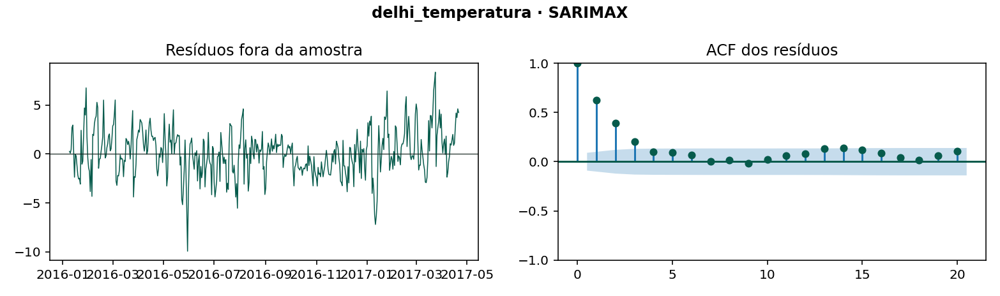

*Delhi · SARIMAX*

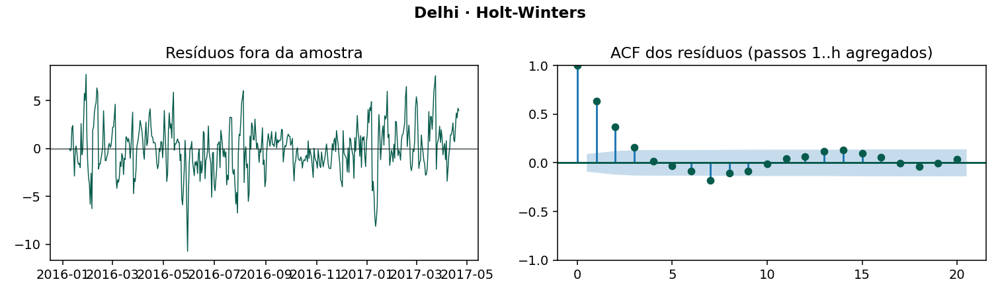

*Delhi · Holt-Winters*

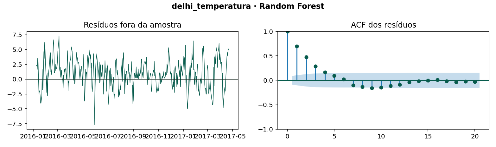

*Delhi · Random Forest*

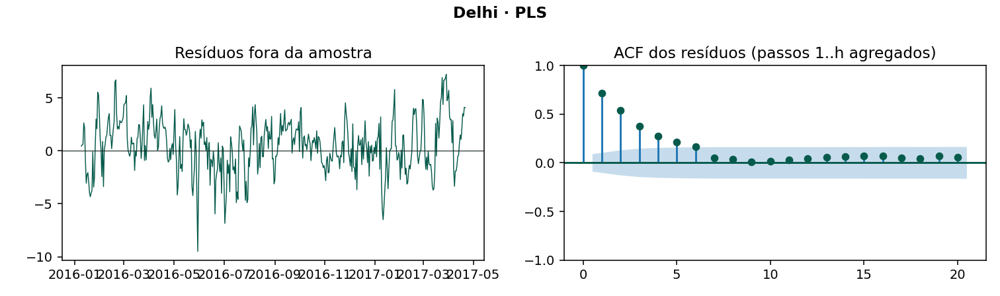

*Delhi · PLS*

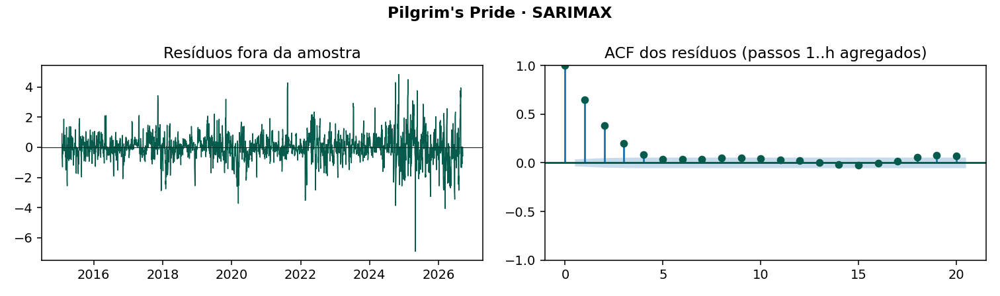

*Pilgrim's Pride · SARIMAX*

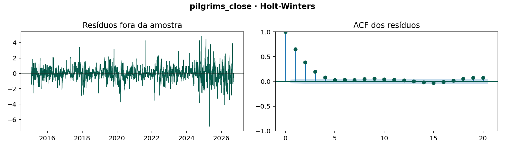

*Pilgrim's Pride · Holt-Winters*

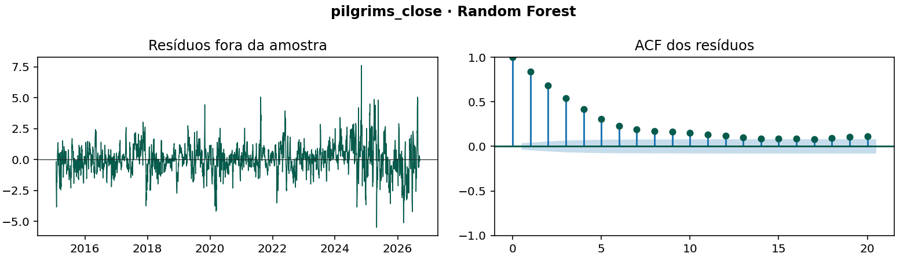

*Pilgrim's Pride · Random Forest*

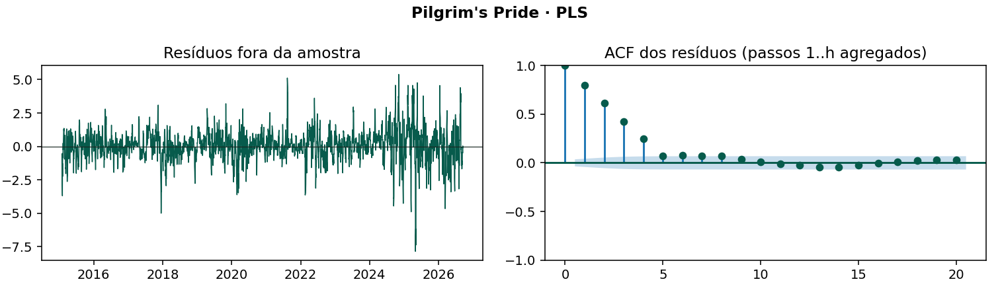

*Pilgrim's Pride · PLS*

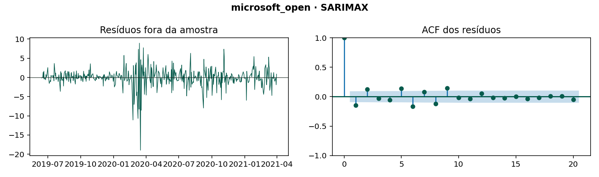

*Microsoft · SARIMAX*

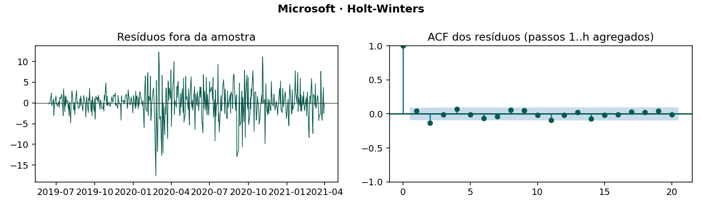

*Microsoft · Holt-Winters*

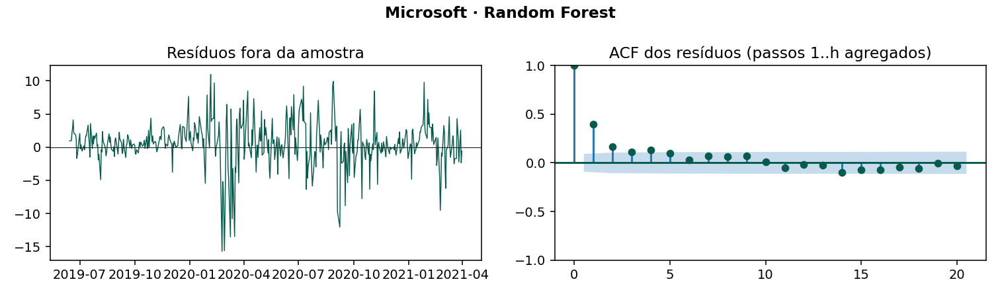

*Microsoft · Random Forest*

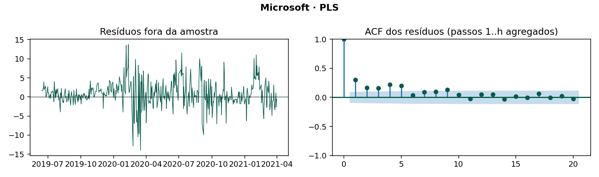

*Microsoft · PLS*

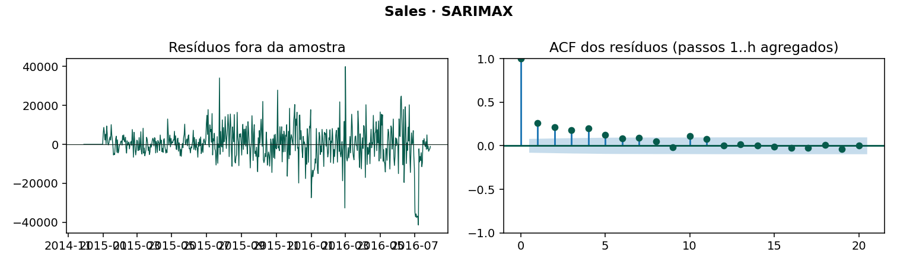

*Sales · SARIMAX*

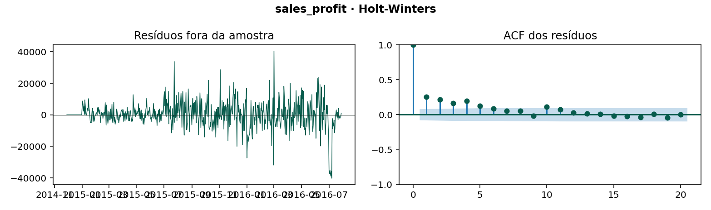

*Sales · Holt-Winters*

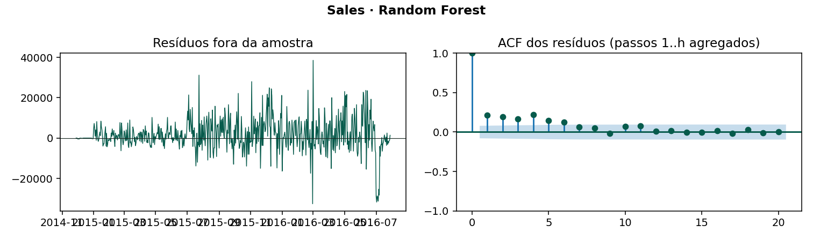

*Sales · Random Forest*

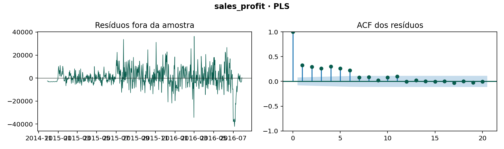

*Sales · PLS*

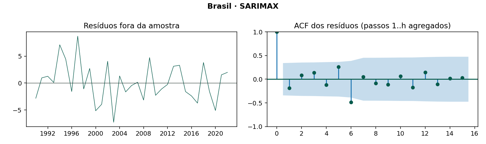

*Brasil · SARIMAX*

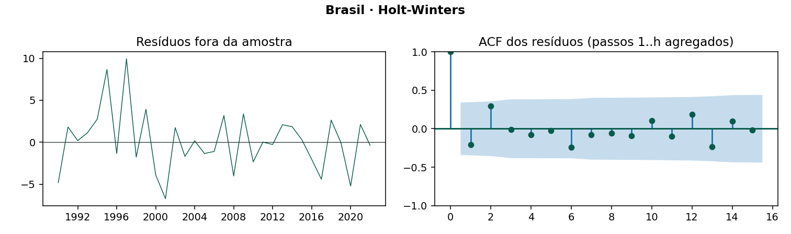

*Brasil · Holt-Winters*

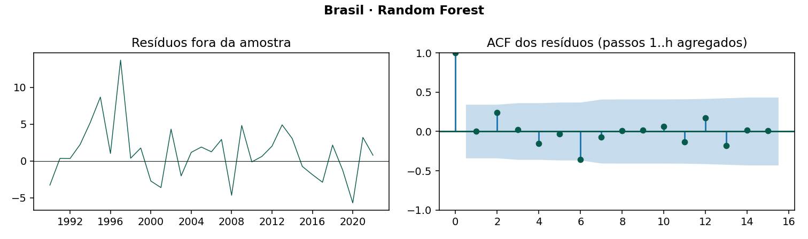

*Brasil · Random Forest*

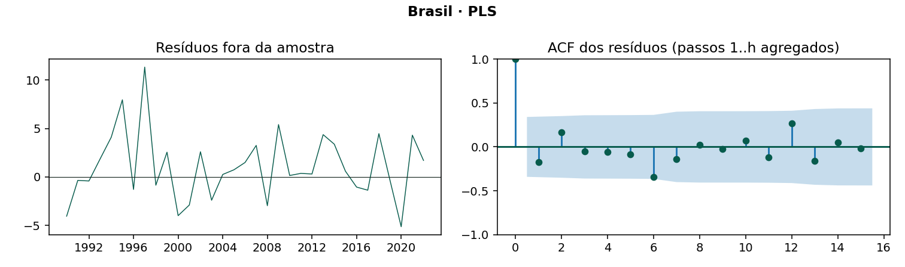

*Brasil · PLS*

## 10. Importância das features

Cada modelo é interpretado pelo método compatível com ele. Random Forest: importância nativa (redução de impureza) e permutation importance. PLS: coeficientes na escala padronizada, VIP scores e permutation importance. SARIMAX: coeficientes das externas, com sinal, magnitude e significância. Holt-Winters: não tem features; interpreta-se o estado final de nível, tendência e sazonalidade. A permutation é medida na validação, com o modelo ajustado até o início dela, porque no treino um modelo que decorou os dados parece depender de tudo. Importância não implica causalidade.

*Random Forest: 5 features de maior permutation importance por base*

| base | feature | tipo | disponibilidade | permutation | nativa |
| --- | --- | --- | --- | --- | --- |
| Brasil | desvio_8 | interna | - | 0,0615 | 0,1349 |
| Brasil | desvio_4 | interna | - | 0,0588 | 0,0596 |
| Brasil | matches_played_lag_1 | externa | defasada | 0,0416 | 0,0207 |
| Brasil | friendly_matches_lag_1 | externa | defasada | 0,0334 | 0,0501 |
| Brasil | lag_5 | interna | - | 0,0283 | 0,0314 |
| Delhi | semana_cos | interna | - | 0,2063 | 0,0819 |
| Delhi | media_4 | interna | - | 0,1585 | 0,1579 |
| Delhi | media_8 | interna | - | 0,0503 | 0,1163 |
| Delhi | semana | interna | - | 0,0388 | 0,0181 |
| Delhi | wind_speed_lag_7 | externa | defasada | 0,0128 | 0,0036 |
| Microsoft | close_lag_1 | externa | conhecida | 0,1957 | 0,3698 |
| Microsoft | lag_1 | interna | - | 0,0266 | 0,1454 |
| Microsoft | lag_2 | interna | - | 0,0051 | 0,0663 |
| Microsoft | volume_lag_1 | externa | conhecida | 0,0045 | 0,0002 |
| Microsoft | desvio_4 | interna | - | 0,0006 | 0,0002 |
| Pilgrim's Pride | lag_5 | interna | - | 0,6959 | 0,1306 |
| Pilgrim's Pride | Low_lag_5 | externa | defasada | 0,6664 | 0,1360 |
| Pilgrim's Pride | media_4 | interna | - | 0,6075 | 0,1335 |
| Pilgrim's Pride | media_12 | interna | - | 0,4926 | 0,1496 |
| Pilgrim's Pride | media_8 | interna | - | 0,4759 | 0,1249 |
| Sales | media_12 | interna | - | 1.597,0125 | 0,1473 |
| Sales | media_8 | interna | - | 1.340,5505 | 0,1351 |
| Sales | transaction_count_lag_7 | externa | defasada | 988,1563 | 0,0953 |
| Sales | media_4 | interna | - | 942,8110 | 0,1000 |
| Sales | lag_10 | interna | - | 475,3915 | 0,0603 |

*PLS: 5 features de maior permutation importance por base*

| base | feature | tipo | disponibilidade | permutation | vip | coeficiente padronizado |
| --- | --- | --- | --- | --- | --- | --- |
| Brasil | desvio_8 | interna | - | 0,0411 | 1,51 | 0,337 |
| Brasil | lag_4 | interna | - | 0,0222 | 1,23 | 0,274 |
| Brasil | desvio_12 | interna | - | 0,0200 | 1,51 | 0,336 |
| Brasil | media_12 | interna | - | 0,0038 | 1,40 | 0,312 |
| Brasil | desvio_4 | interna | - | -0,0007 | 1,08 | 0,240 |
| Delhi | semana_cos | interna | - | 1,2014 | 1,42 | -2,276 |
| Delhi | media_12 | interna | - | 0,9994 | 1,43 | 2,479 |
| Delhi | mes_cos | interna | - | 0,5170 | 1,35 | -1,426 |
| Delhi | semana_sin | interna | - | 0,5130 | 0,47 | -1,335 |
| Delhi | mes_sin | interna | - | 0,4170 | 0,62 | 1,103 |
| Microsoft | lag_1 | interna | - | 1,6302 | 1,53 | 4,553 |
| Microsoft | close_lag_1 | externa | conhecida | 0,1902 | 1,53 | 9,108 |
| Microsoft | lag_2 | interna | - | 0,1628 | 1,53 | 0,914 |
| Microsoft | semana | interna | - | 0,0642 | 0,17 | 0,609 |
| Microsoft | lag_30 | interna | - | 0,0370 | 1,48 | 0,304 |
| Pilgrim's Pride | lag_5 | interna | - | 5,8782 | 1,51 | 4,605 |
| Pilgrim's Pride | Low_lag_5 | externa | defasada | 0,8978 | 1,51 | 0,929 |
| Pilgrim's Pride | media_8 | interna | - | 0,6413 | 1,50 | 0,709 |
| Pilgrim's Pride | lag_6 | interna | - | 0,2754 | 1,50 | -0,421 |
| Pilgrim's Pride | media_12 | interna | - | 0,0867 | 1,50 | -0,220 |
| Sales | transaction_count_lag_7 | externa | defasada | 3.875,6264 | 1,63 | 2.361,542 |
| Sales | media_12 | interna | - | 2.024,8367 | 1,54 | 953,631 |
| Sales | media_8 | interna | - | 1.617,7574 | 1,54 | 802,856 |
| Sales | desvio_12 | interna | - | 539,9463 | 1,07 | 612,870 |
| Sales | lag_10 | interna | - | 181,3098 | 1,17 | 143,666 |

*Quanto da importância (permutation positiva) vem das variáveis externas*

| base | modelo | % da importância nas externas | externa mais importante | posição dela no ranking |
| --- | --- | --- | --- | --- |
| Brasil | PLS | 0,0 | friendly_matches_lag_1 | 12 |
| Brasil | Random Forest | 21,8 | matches_played_lag_1 | 3 |
| Delhi | PLS | 8,6 | meanpressure_lag_7 | 6 |
| Delhi | Random Forest | 2,9 | wind_speed_lag_7 | 5 |
| Microsoft | PLS | 8,9 | close_lag_1 | 2 |
| Microsoft | Random Forest | 85,4 | close_lag_1 | 1 |
| Pilgrim's Pride | PLS | 11,4 | Low_lag_5 | 2 |
| Pilgrim's Pride | Random Forest | 17,7 | Low_lag_5 | 2 |
| Sales | PLS | 44,6 | transaction_count_lag_7 | 1 |
| Sales | Random Forest | 15,6 | transaction_count_lag_7 | 3 |

As externas ganham espaço onde trazem informação que os lags do alvo não têm e que está disponível na origem. Em Microsoft, `close_lag_1` é conhecida na origem (é o fechamento de ontem) e por isso pode entrar sem defasagem extra. Em Sales, `transaction_count_lag_7` é uma externa defasada em h = 7, porque o número de transações do dia só é conhecido depois que o dia termina. Em Delhi e Pilgrim's, as externas entram defasadas em h e carregam pouco além do que os próprios lags do alvo já informam.

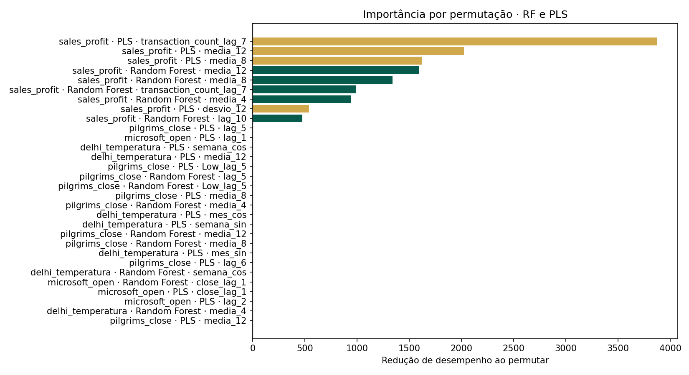

*Permutation importance (RF e PLS)*

*SARIMAX: coeficientes das externas no ajuste até o fim da validação*

| base | exogena | disponibilidade | coeficiente | sinal | erro_padrao | p_valor | significativa |
| --- | --- | --- | --- | --- | --- | --- | --- |
| Delhi | humidity_lag_7 | defasada | 0,00181 | positivo | 0,00593 | 0,7597 | não |
| Delhi | wind_speed_lag_7 | defasada | 0,00602 | positivo | 0,01167 | 0,6059 | não |
| Delhi | meanpressure_lag_7 | defasada | 0,01358 | positivo | 0,02653 | 0,6086 | não |
| Pilgrim's Pride | Low_lag_5 | defasada | -0,01965 | negativo | 0,00871 | 0,0240 | sim |
| Pilgrim's Pride | Volume_lag_5 | defasada | -5,90e-09 | negativo | 4,45e-09 | 0,1846 | não |
| Microsoft | close_lag_1 | conhecida | 1,00064 | positivo | 0,00050 | 0,0000 | sim |
| Microsoft | volume_lag_1 | conhecida | 6,40e-10 | positivo | 1,12e-09 | 0,5682 | não |
| Sales | transaction_count_lag_7 | defasada | -26,78156 | negativo | 6,74473 | 7,16e-05 | sim |
| Brasil | matches_played_lag_1 | defasada | -0,39180 | negativo | 0,19086 | 0,0401 | sim |
| Brasil | friendly_matches_lag_1 | defasada | 0,10359 | positivo | 0,21257 | 0,6260 | não |

*Holt-Winters: estado final (nível, tendência e amplitude sazonal)*

| base | nivel_final | tendencia_final | amplitude_sazonal | amplitude_sobre_nivel_pct | trend | seasonal | damped |
| --- | --- | --- | --- | --- | --- | --- | --- |
| Delhi | 15,874 | 2,25e-07 | — | — | add | — | sim |
| Pilgrim's Pride | 21,278 | — | — | — | — | — | não |
| Microsoft | 144,823 | 0,094 | 0,018 | 0,0 | add | mul | não |
| Sales | 3,13e-08 | — | — | — | — | — | não |
| Brasil | 7,710 | — | 2,718 | 35,3 | — | add | não |

## 11. Explicação aprofundada do modelo escolhido

### Intuição

O PLS Regression (Partial Least Squares) resume muitas features correlacionadas em poucos componentes latentes e faz a regressão nesse espaço reduzido. A diferença para o PCA está em como os componentes são escolhidos: o PCA busca as direções de maior variância de X, sem olhar o alvo; o PLS busca as direções de X com maior covariância com y. Os componentes são, portanto, supervisionados: um componente que explica muita variância de X mas nada de y é irrelevante para o PLS.

Isso combina com séries temporais: lags, médias e desvios móveis da mesma série são fortemente correlacionados entre si, e uma regressão linear comum sobre eles teria coeficientes instáveis. O PLS concentra essa informação compartilhada em poucas direções úteis para prever.

### Como o algoritmo funciona (NIPALS, um alvo)

Com X e y centralizados: (1) o peso w é a direção de X com maior covariância com y, proporcional a Xᵀy; (2) o score t = Xw é a projeção das observações nessa direção; (3) y é regredido em t, e X é 'deflacionado', removendo a parte explicada por t. O passo se repete para o próximo componente sobre o que sobrou. Com um único alvo (PLS1), cada componente converge em uma iteração, o que o pipeline confere pelo `n_iter_`. A previsão final é uma combinação linear das features originais.

### Hipóteses, vantagens, limitações e preparação

Vantagens: tolera multicolinearidade, funciona com muitas features e é interpretável por coeficientes e VIP. Hipóteses e limitações: a relação é linear no espaço latente, então interações e descontinuidades não são aprendidas como numa floresta; é sensível à escala e a outliers; e, por ser linear, extrapola níveis fora da faixa do treino com os mesmos pesos, o que pesa em séries de preço com mudança de patamar. Preparação: padronização das features em cada janela (`StandardScaler`, com `PLSRegression(scale=False)` para não padronizar duas vezes) e tratamento das externas extremas.

Dois ajustes próprios do grupo, aprendidos só no treino: **(1) remoção de redundâncias exatas** — `media_4` é a média de `lag_h … lag_h+3` e `delta_nivel` = `media_4` − `media_12`; no Brasil, `semana_cos` é constante em função de `semana_sin` na série anual. Removidas: delta_nivel, media_4, semana_cos. Sem isso, o posto de X fica abaixo do número de colunas e componentes além do posto ajustam erro de arredondamento. **(2) Winsorização só das externas** nos quantis de 0,5% e 99,5% do treino de cada origem, para conter erros de medição como as pressões impossíveis de Delhi. Lags e janelas do alvo não são limitados, para o modelo acompanhar níveis novos.

### Hiperparâmetros, efeito e otimização

O hiperparâmetro principal é `n_components`: poucos componentes subajustam (o modelo vira uma média suavizada das features); muitos reincorporam ruído e aproximam o PLS de uma regressão comum sobre todas as features. A grade testa todos os valores de 1 até o menor entre 30, o posto de X e o tamanho da menor janela de treino menos 1, e vence o menor MAE walk-forward na validação. `max_iter` = 500 e `tol` = 1e-6 só controlam a convergência e não precisam de busca no PLS1.

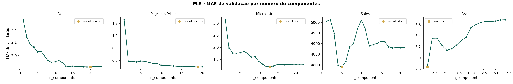

*Curva de validação do PLS*

Escolhas: Delhi escolheu 20 de 23; Pilgrim's Pride escolheu 19 de 20; Microsoft escolheu 13 de 22; Sales escolheu 5 de 21; Brasil escolheu 1 de 17. Sales e Brasil, as séries mais ruidosas, ficaram com poucos componentes (forte redução de dimensão funciona como regularização); nas demais, a curva cai até algo entre 10 e 20 componentes e depois fica plana.

### Importância das features no PLS

O VIP (Variable Importance in Projection) mede quanto cada feature pesa na construção dos componentes, ponderado pelo quanto cada componente explica de y; VIP ≥ 1 é a referência usual de relevância. O coeficiente padronizado dá a direção e o tamanho do efeito na previsão. A permutation importance mede quanto o MAE de validação piora ao embaralhar a feature. As medidas discordam de forma informativa: uma feature pode ter VIP alto e permutation baixa quando a mesma informação está numa feature irmã.

Delhi: maior VIP `media_8` (1,44), maior permutation `semana_cos`; externas com VIP ≥ 1: `meanpressure_lag_7`. Pilgrim's Pride: maior VIP `lag_5` (1,51), maior permutation `lag_5`; externas com VIP ≥ 1: `Low_lag_5`, `Volume_lag_5`. Microsoft: maior VIP `close_lag_1` (1,53), maior permutation `lag_1`; externas com VIP ≥ 1: `close_lag_1`. Sales: maior VIP `transaction_count_lag_7` (1,63), maior permutation `transaction_count_lag_7`; externas com VIP ≥ 1: `transaction_count_lag_7`. Brasil: maior VIP `desvio_8` (1,51), maior permutation `desvio_8`; externas com VIP ≥ 1: nenhuma.

### Desempenho nas cinco bases

*PLS por base (MAE / ingênuo < 1 = melhor que repetir o último valor)*

| base | componentes | features | MAE validação | MAE teste | MAE / ingênuo | posição (de 4) | Ljung-Box: passos com p ≤ 0,05 |
| --- | --- | --- | --- | --- | --- | --- | --- |
| Delhi | 20 | 23 | 1,916 | 1,981 | 1,02 | 2 | 1 de 7 |
| Pilgrim's Pride | 19 | 20 | 0,497 | 0,829 | 1,35 | 3 | 0 de 5 |
| Microsoft | 13 | 22 | 1,195 | 2,495 | 0,98 | 3 | 1 de 1 |
| Sales | 5 | 21 | 4.791,286 | 5.974,187 | 0,82 | 4 | 0 de 7 |
| Brasil | 1 | 17 | 2,837 | 2,677 | 0,70 | 2 | 0 de 1 |

Explicações: o PLS ganha do ingênuo onde o alvo é ruidoso e pouco persistente — Sales (18% melhor) e Brasil (30%) —, porque as médias móveis funcionam como encolhimento do ruído. Em Microsoft e Delhi fica praticamente empatado com o ingênuo (razões 0,98 e 1,02): o último valor já é quase toda a informação. Em Pilgrim's perde (1,35): os pesos de sinais opostos nos lags foram aprendidos em níveis de preço baixos e amplificam o ruído no teste, onde o preço é várias vezes maior. Em Microsoft, o Ljung-Box ainda indica padrão residual; uma causa plausível é a winsorização de `close_lag_1`, que é um nível de preço e passa a ser limitado quando a ação supera a faixa do treino.

### Histórico e transparência

A primeira versão do PLS previu 1.252,94 °C em Delhi para 2016-04-04, uma data do teste, por causa das pressões impossíveis da base. Uma ablação posterior mostrou que, sem a limitação da grade ao posto de X, Pilgrim's e Microsoft explodiam, e que limitar também os lags do alvo gerava viés nas séries de preço. A versão final remove as redundâncias exatas e winsoriza só as externas. Como essas correções foram motivadas por erros observados no teste, os MAEs de teste do PLS não são estimativas totalmente intocadas; a documentação completa está em `DOCUMENTACAO_PLS.md`.

## 12. Conclusões, limitações e recomendações

**Conclusões.** Nenhum modelo domina: **SARIMAX** venceu Microsoft; **Holt-Winters** venceu Brasil, Delhi e Pilgrim's Pride; **Random Forest** venceu Sales. No placar, Holt-Winters lidera com 3 vitórias e posição média 1,8. O Holt-Winters, mesmo sem externas, venceu 3 bases: é uma referência difícil de bater em séries persistentes. As externas só fazem diferença quando são conhecidas na origem e trazem informação nova, como em Microsoft. O PLS entregou o que promete — estabilidade sob features colineares e interpretabilidade —, mas não superou modelos especializados em nenhuma base.

**Limitações.** (1) Sales: a lacuna de cinco meses virou lucro zero e afeta o fim da validação e o início do teste; as linhas idênticas da fonte foram somadas como transações. Os resultados de Sales devem ser lidos com essa ressalva. (2) Delhi: o SARIMAX usa as externas sem tratamento e previu 129,7 °C para 04/04/2016 (observado: 32,8 °C), porque a pressão defasada dessa data é 7.679,3 hPa, fisicamente impossível; sem essa origem, o MAE dele cairia de 2,026 para 1,820. As posições de Delhi refletem essa diferença de tratamento das externas entre os modelos. (3) Para limitar o custo do SARIMAX, m ≤ 30; o ciclo anual de Delhi e o de 252 pregões das ações ficam só nas features de calendário. (4) O Ljung-Box agregado rejeita por construção quando h > 1; o diagnóstico por passo é o que vale para essas bases. (5) A winsorização do PLS foi decidida após observar um erro no teste. (6) Não foi possível confirmar na fonte se os preços da Pilgrim's Pride são ajustados por dividendos e desdobramentos. (7) Random Forest e Holt-Winters podem variar levemente com a versão de scikit-learn e statsmodels; as versões usadas estão em `requirements.txt`.

**Recomendações.** Selecionar o modelo por base, não um único para todas; monitorar MAE por horizonte, viés e Ljung-Box por passo; tratar na origem as lacunas de Sales (como ausência de dado, não como zero) e as pressões impossíveis de Delhi; recalibrar quando a degradação for sustentada, e não por um ponto isolado; e, se os intervalos do Kalman forem usados, calibrá-los antes (seção 14).

## 13. Referências

Base Delhi: https://www.kaggle.com/datasets/sumanthvrao/daily-climate-time-series-data

Base Pilgrim's Pride: https://www.kaggle.com/datasets/mandalorianforza/pilgrims-pride-ppc-daily-stock-price-history

Base Microsoft: https://www.kaggle.com/datasets/vijayvvenkitesh/microsoft-stock-time-series-analysis

Base Sales: https://www.kaggle.com/datasets/sadiqshah/bike-sales-in-europe

Base Brasil: https://www.kaggle.com/datasets/azminetoushikwasi/brazil-all-international-matches-19142023

Hyndman, R. J.; Athanasopoulos, G. Forecasting: Principles and Practice, 3rd ed. OTexts, 2021. https://otexts.com/fpp3/

Cleveland, R. B. et al. STL: A Seasonal-Trend Decomposition Procedure Based on Loess. Journal of Official Statistics, 6(1), 3–73, 1990.

Ljung, G. M.; Box, G. E. P. On a Measure of Lack of Fit in Time Series Models. Biometrika, 65(2), 297–303, 1978. https://doi.org/10.1093/biomet/65.2.297

Geladi, P.; Kowalski, B. R. Partial least-squares regression: a tutorial. Analytica Chimica Acta, 185, 1–17, 1986. https://doi.org/10.1016/0003-2670(86)80028-9

Wold, S.; Sjöström, M.; Eriksson, L. PLS-regression: a basic tool of chemometrics. Chemometrics and Intelligent Laboratory Systems, 58, 109–130, 2001. https://doi.org/10.1016/S0169-7439(01)00155-1

Breiman, L. Random Forests. Machine Learning, 45, 5–32, 2001.

statsmodels: STL, SARIMAX, ExponentialSmoothing e acorr_ljungbox. https://www.statsmodels.org/stable/tsa.html

scikit-learn: PLSRegression, RandomForestRegressor e permutation_importance. https://scikit-learn.org/stable/modules/cross_decomposition.html ; https://scikit-learn.org/stable/modules/permutation_importance.html

Enunciado do trabalho: n2_series_temporais.pdf. Código: prepare_bases.ipynb e pipeline.ipynb; artefatos em resultados/.

## 14. Apêndices técnicos e registro de demandas

### Bônus: regressão dinâmica com filtro de Kalman

O Kalman estima coeficientes que mudam no tempo (y_t = x_tᵀβ_t + ε_t, β_t = β_{t−1} + η_t), com a sequência causal prever → atualizar e sem atualização dentro do horizonte futuro. Q e R são escolhidos na validação. Ele produz intervalos de previsão; a cobertura observada mostra se são confiáveis.

*Configurações bônus (fora do placar)*

| base | modelo | MAE | ganho sobre o ingênuo (%) | MAE do melhor oficial |
| --- | --- | --- | --- | --- |
| Brasil | Kalman | 3,276 | 14,2 | 2,645 |
| Delhi | Kalman | 1,930 | 0,7 | 1,885 |
| Microsoft | Kalman \| Fourier+ACF m=176 | 2,175 | 14,4 | 1,503 |
| Microsoft | Kalman | 2,204 | 13,3 | 1,503 |
| Microsoft | Random Forest \| Fourier+ACF m=176 | 2,341 | 7,9 | 1,503 |
| Microsoft | PLS \| Fourier+ACF m=176 | 2,415 | 5,0 | 1,503 |
| Pilgrim's Pride | PLS \| Fourier+ACF m=2275 | 0,830 | -34,8 | 0,616 |
| Pilgrim's Pride | Random Forest \| Fourier+ACF m=2275 | 0,849 | -37,8 | 0,616 |
| Pilgrim's Pride | Kalman \| Fourier+ACF m=2275 | 0,871 | -41,3 | 0,616 |
| Pilgrim's Pride | Kalman | 0,886 | -43,8 | 0,616 |
| Sales | Kalman | 6.496,099 | 11,3 | 5.479,244 |

*Kalman: cobertura dos intervalos no teste*

| base | cobertura 80% (nominal 80) | cobertura 95% (nominal 95) | largura média do intervalo 95% |
| --- | --- | --- | --- |
| Brasil | 93,9 | 100,0 | 23,80 |
| Delhi | 94,2 | 98,3 | 14,14 |
| Microsoft | 60,7 | 77,0 | 5,78 |
| Pilgrim's Pride | 74,8 | 89,3 | 3,66 |
| Sales | 86,0 | 94,7 | 34.515,96 |

### Bônus: investigação sazonal por Fourier + ACF

Picos do espectro de Fourier e da ACF propõem períodos candidatos; a força STL escolhe entre eles. Um período alternativo só vira configuração bônus quando ganha pelo menos 0,05 de força sobre o padrão. Ganho de força não garante ganho de previsão: em Pilgrim's, m = 2275 (cerca de 9 anos, só 3 ciclos) provavelmente captura tendência e não um ciclo real.

*Períodos investigados*

| base | m padrão | candidato | ganho de força | m efetivo | decisão |
| --- | --- | --- | --- | --- | --- |
| Delhi | 30 | 36 | 0,039 | 30 | ganho_sazonal_0.039016_abaixo_de_0.05 |
| Pilgrim's Pride | 1 | 2.275 | 0,572 | 2.275 | ganho_sazonal_aprovado |
| Microsoft | 30 | 176 | 0,430 | 176 | ganho_sazonal_aprovado |
| Sales | 12 | 11 | 0,033 | 12 | ganho_sazonal_0.032941_abaixo_de_0.05 |
| Brasil | 4 | 4 | 0,000 | 4 | mesmo_periodo_padrao |

### Sales: distribuição por partição

*Lucro diário de Sales em treino, validação e teste*

| particao | n | media | mediana | desvio | iqr | p90 | p95 | p99 | maximo | zeros | outliers_iqr |
| --- | --- | --- | --- | --- | --- | --- | --- | --- | --- | --- | --- |
| treino | 999 | 8.729,8 | 7.253,0 | 6.075,5 | 6.183,5 | 15.529,2 | 20.961,7 | 30.604,5 | 43.617,0 | 1 | 52 |
| validacao | 428 | 20.877,4 | 25.224,0 | 15.471,3 | 32.430,5 | 38.798,5 | 43.107,7 | 49.220,1 | 59.253,0 | 119 | 0 |
| teste | 612 | 23.798,2 | 24.834,0 | 16.411,9 | 28.368,5 | 44.710,0 | 50.862,0 | 60.035,2 | 72.218,0 | 35 | 0 |

### Reprodutibilidade

Os resultados são reproduzíveis a partir dos arquivos entregues: `prepare_bases.ipynb` gera as bases; `pipeline.ipynb`, executado do início ao fim, reaproveita os checkpoints de `resultados/checkpoints_final/` (ou refaz tudo com `rodar(bases, refazer=True)`, cerca de 3 horas) e esta última célula gera Markdown, HTML e PDF a partir dos CSVs. Instruções e versões das bibliotecas estão em `README.md` e `requirements.txt`.

Uso de IA: o grupo usou ferramentas de IA como apoio à implementação, à revisão e à redação. Código, resultados e interpretações foram revisados criticamente pelos integrantes, que assumem a responsabilidade integral pelo conteúdo.

### Registro diário de demandas

*Registro de demandas (relatorio/registro_demandas.csv)*

| Data | Integrante | Demanda realizada | Entrega ou evidência | Carga de trabalho | Complexidade | Status |
| --- | --- | --- | --- | --- | --- | --- |
| 10/09/2026 | Fernando Paiva | Organização geral do projeto | relato do integrante (sem arquivo) | Baixa | Baixa | Concluída |
| 10/09/2026 | Giovanna Pelati | Organização geral do projeto | relato do integrante (sem arquivo) | Baixa | Baixa | Concluída |
| 10/09/2026 | João Vargas | Organização geral do projeto | relato do integrante (sem arquivo) | Baixa | Baixa | Concluída |
| 10/09/2026 | Matheus Cury | Organização geral do projeto | relato do integrante (sem arquivo) | Baixa | Baixa | Concluída |
| 10/09/2026 | Sophia Gasparetto | Organização geral e pesquisa das bases | relato do integrante (sem arquivo) | Baixa | Baixa | Concluída |
| 15/09/2026 | Sophia Gasparetto | Criação do repositório e inclusão das bases brutas | commits 6570257 e b977dc5; bases/raw/ | Baixa | Baixa | Concluída |
| 15/09/2026 | Matheus Cury | Estrutura inicial do pipeline.ipynb (leitura das bases e esqueleto das etapas) | commit d8372a1; pipeline.ipynb | Média | Média | Concluída |
| 15/09/2026 | Fernando Paiva | Definição das especificações e das bases | relato do integrante (sem arquivo) | Média | Média | Concluída |
| 15/09/2026 | João Vargas | Estudo e documentação do projeto | relato do integrante (sem arquivo) | Média | Baixa | Concluída |
| 17/09/2026 | Matheus Cury | Regras fixas do grupo: random_state=42 e separação 70-30 em treino/validação/teste | commit 110802c; pipeline.ipynb (seções 0 e 1) | Baixa | Baixa | Concluída |
| 17/09/2026 | Matheus Cury | Seleção do SARIMAX por BIC com desempate por MAE de validação | commit 24a7206; pipeline.ipynb (seção 3.5) | Média | Média | Concluída |
| 17/09/2026 | Matheus Cury | Escolha do período sazonal m pela força da STL em vez de m fixo | commit 4d5fb42; pipeline.ipynb (seção 2.3) | Média | Média | Concluída |
| 17/09/2026 | Sophia Gasparetto | Notebook reprodutível de preparação das cinco bases | commit 6a597fc; prepare_bases.ipynb; bases/*_prepared.csv | Alta | Média | Concluída |
| 17/09/2026 | Fernando Paiva | Adição de elementos na pipeline padrão | relato do integrante; pipeline.ipynb | Média | Média | Concluída |
| 17/09/2026 | João Vargas | Base do relatório e entendimento da pipeline | relato do integrante (sem arquivo) | Média | Baixa | Concluída |
| 22/09/2026 | Sophia Gasparetto | Correção da preparação das bases Brasil e Sales | commit 25dd002; bases/brazil_prepared.csv; bases/sales_prepared.csv | Média | Média | Concluída |
| 22/09/2026 | Matheus Cury | Registro das cinco bases no pipeline com horizonte e exógenas | commit 9bb436d; pipeline.ipynb (seção 1) | Média | Média | Concluída |
| 22/09/2026 | Giovanna Pelati | Revisão da pipeline e início da implementação do modelo de especialização | relato do integrante; pipeline.ipynb | Média | Média | Concluída |
| 24/09/2026 | Matheus Cury | Análise prévia completa (STL; ADF/KPSS; VIF) e correção do mapeamento das exógenas | commit 42c20ab; resultados/decisoes_analise.csv; resultados/disponibilidade_exogenas.csv | Alta | Alta | Concluída |
| 24/09/2026 | Matheus Cury | Importância das features (RF nativa e permutation; PLS; coeficientes SARIMAX; estado Holt-Winters) | commit f0bbcec; resultados/importancia_features.csv | Média | Média | Concluída |
| 24/09/2026 | Matheus Cury | Primeira rodada de treino dos modelos | commit ab660c4; pipeline.ipynb | Média | Média | Concluída |
| 24/09/2026 | Giovanna Pelati | Estudo e documentação do PLS | relato do integrante; DOCUMENTACAO_PLS.md (versionado no commit f494704) | Média | Alta | Concluída |
| 25/09/2026 | Matheus Cury | Rodada completa do pipeline (5 bases x 4 modelos) com caches do SARIMAX | commit fc30f94; resultados/previsoes.csv; resultados/hiperparametros.csv | Alta | Média | Concluída |
| 27/09/2026 | João Vargas | Primeira versão do relatório (Markdown; HTML; PDF) e tabelas de MAE e Ljung-Box | commit ee95811; relatorio/RELATORIO.md; relatorio/relatorio.html; relatorio/relatorio.pdf | Alta | Média | Concluída |
| 28/09/2026 | Giovanna Pelati | Implementação do PLS (remoção de redundâncias; winsorização das externas; grade até o posto de X; VIP) | commits f494704 e 8b9cf34; pipeline.ipynb (seções 3.8 e 4.6); DOCUMENTACAO_PLS.md | Alta | Alta | Concluída |
| 29/09/2026 | Sophia Gasparetto | Exploração aprofundada das bases (item 5.1): estatísticas; checagens de consistência; painéis | commit 4e042e6; relatorio/item_5_1_documentacao_exploracao.md; resultados/item_5_1/ | Alta | Média | Concluída |
| 01/10/2026 | Matheus Cury | Bônus Kalman e Fourier+ACF; checkpoints; gerador do relatório; consolidação dos artefatos | commit 6baec99; pipeline.ipynb (seções 2.3B; 3.9; 3.10; 5) | Alta | Alta | Concluída |
| 04/10/2026 | Giovanna Pelati | Revisão final: reexecução isolada dos notebooks e verificação de reprodutibilidade das 31 configurações | reexecução dos notebooks em cópia isolada; comparação das previsões com resultados/previsoes.csv | Alta | Alta | Concluída |
| 05/10/2026 | Giovanna Pelati | Correção da divergência código x resultados (SARIMAX sem winsorização; Kalman refeito); limpeza do repositório; relatório final | pipeline.ipynb; resultados/; relatorio/; README.md | Alta | Alta | Concluída |
