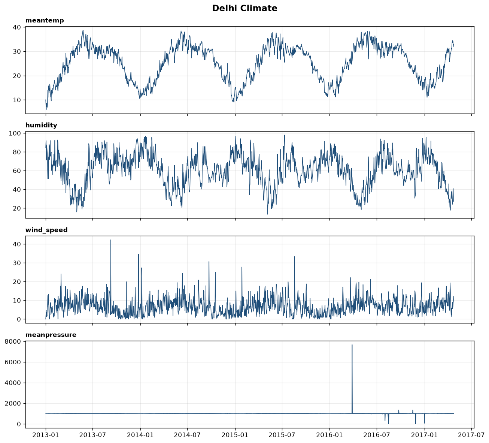
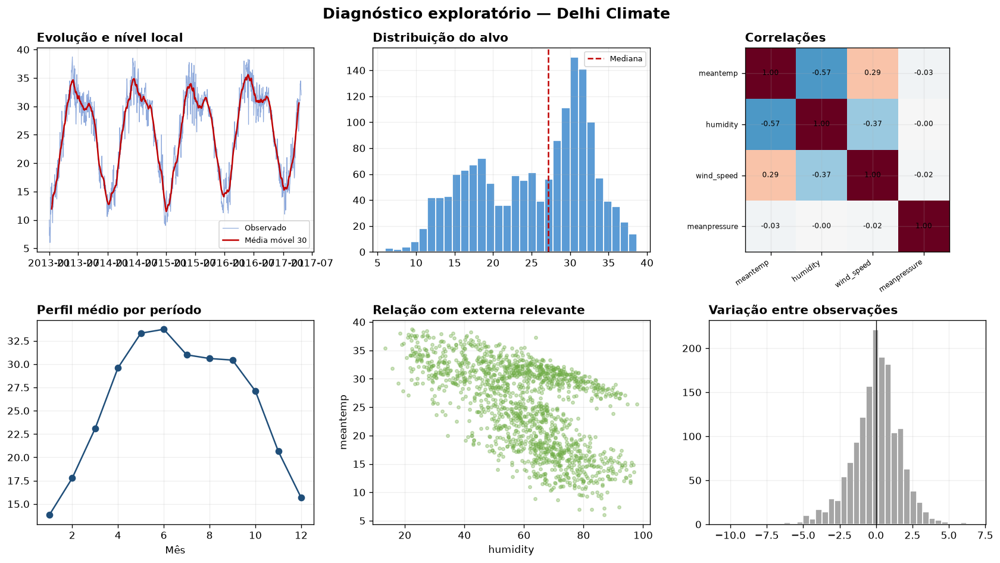
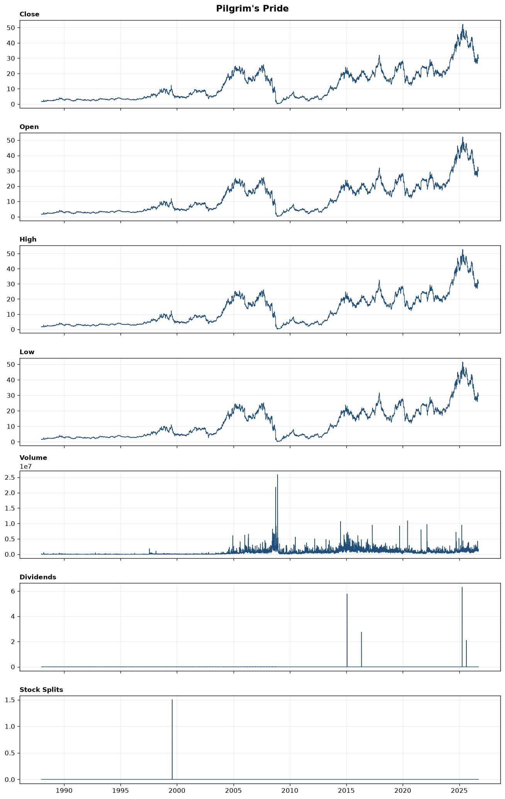
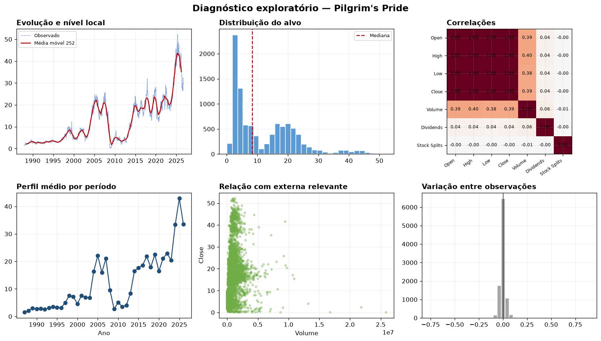
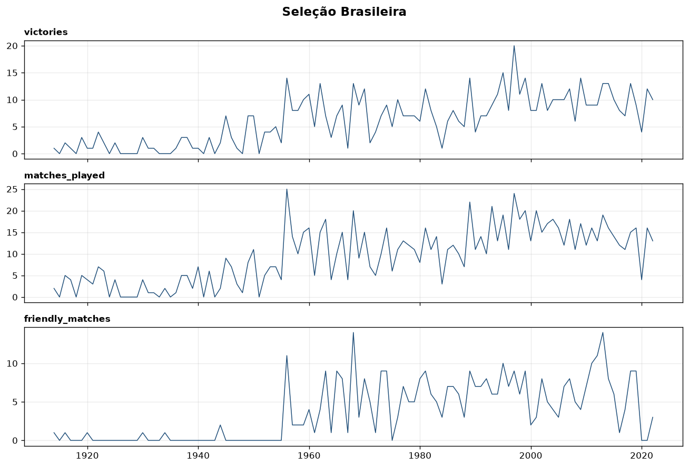
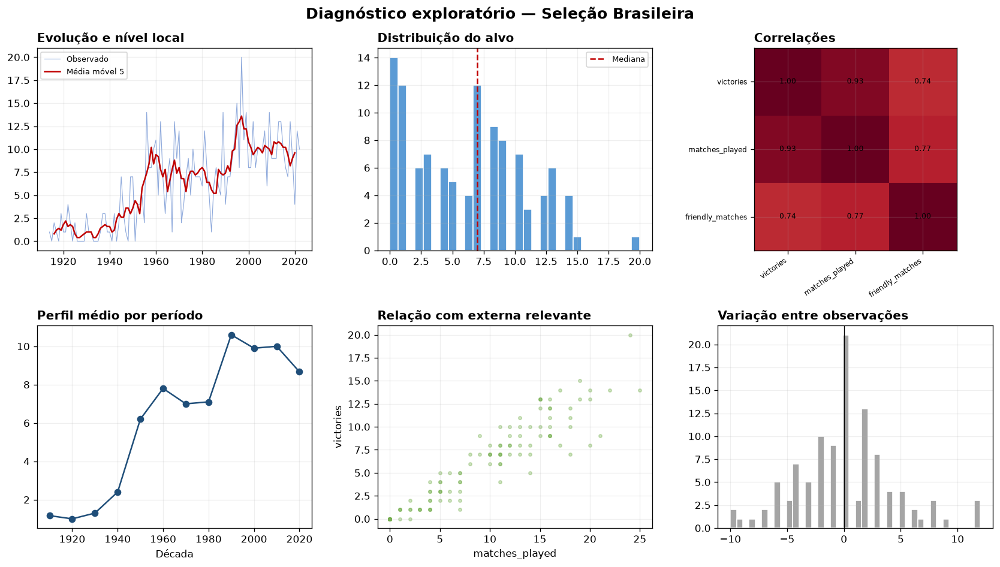
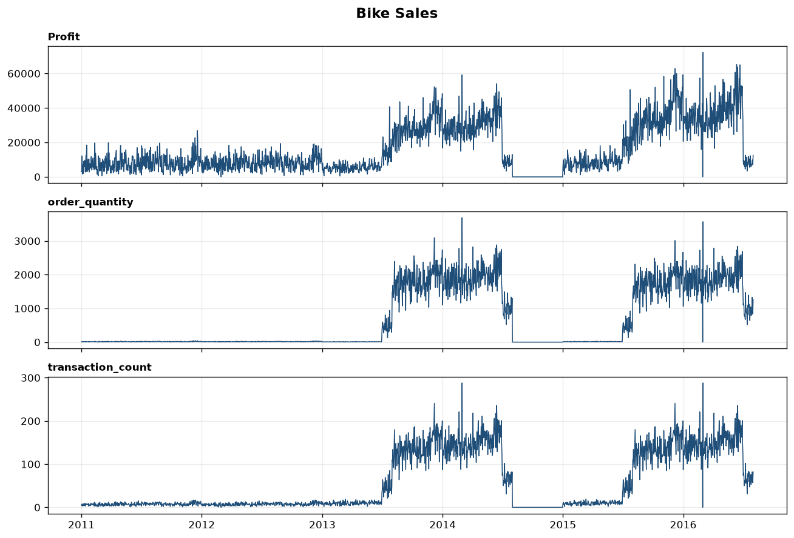
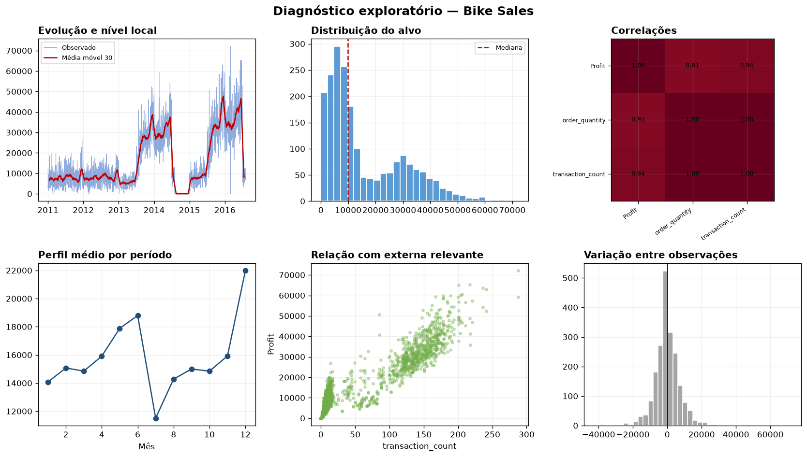
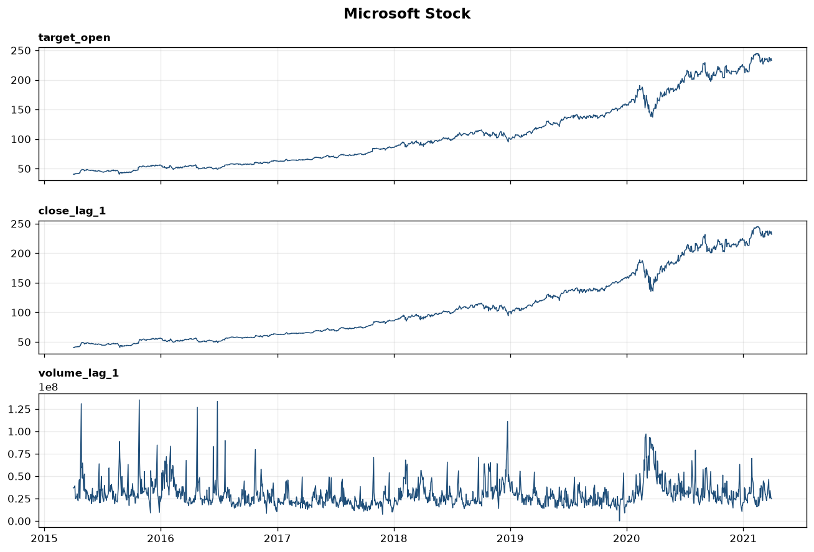
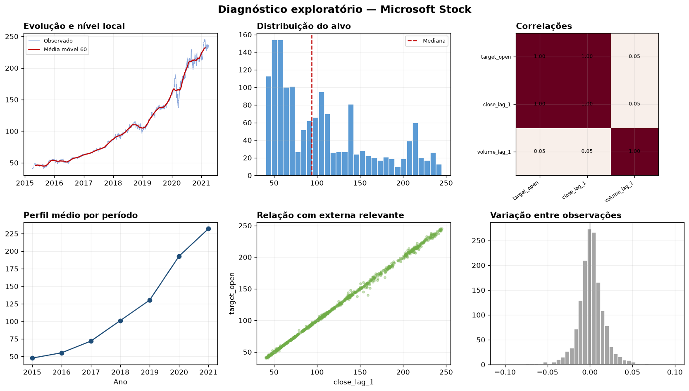

# Documentação e exploração aprofundada das cinco bases

Este documento cobre o item 5.1 do trabalho: fonte, descrição, período, frequência, unidade do alvo, dicionário das variáveis externas, qualidade dos dados, exploração gráfica e decisões de limpeza. A análise foi mantida separada do `pipeline.ipynb`: não há aqui construção de features, escolha de período sazonal, validação walk-forward, otimização ou ajuste de modelos.

## 1. Síntese executiva

As cinco bases ficaram cronologicamente ordenadas, sem datas duplicadas e sem valores ausentes depois da preparação. Isso, porém, não significa que tenham a mesma qualidade analítica. Os principais riscos encontrados são diferentes em natureza:

| Base | Principal evidência | Risco para a análise | Decisão recomendada |
|---|---|---|---|
| Delhi Climate | 8 pressões fora de 870–1.100 hPa, incluindo -3,04 e 7.679,33 hPa | Externa com erros de medição ou registro | Marcar como ausente e imputar somente dentro de cada janela de treino |
| Pilgrim's Pride | Retornos de -75,8% e +88,9% em 2008; 10 sessões com volume zero | Eventos extremos dominam medidas globais | Manter eventos reais, conferir ajustes corporativos e analisar retornos |
| Seleção Brasileira | 12 anos sem partidas e correlação de 0,929 entre vitórias e partidas | Total de vitórias confunde desempenho com quantidade de jogos | Interpretar vitórias junto de partidas e taxa de vitórias |
| Bike Sales | 153 dias consecutivos zerados entre 01/08 e 31/12/2014 | Zero pode representar lacuna de cobertura, não ausência real de vendas | Confirmar a cobertura antes de tratar todo o intervalo como venda zero |
| Microsoft Stock | Gaps de abertura de até -18,83 USD; extremos concentrados em março de 2020 | Choques de mercado e tendência dominam a série | Manter os eventos e evitar interpretar correlação em nível como causalidade |

## 2. Visão comparativa

| Base | Alvo | Período preparado | Frequência | Observações | Ausentes | Datas duplicadas |
|---|---|---:|---|---:|---:|---:|
| Delhi Climate | `meantemp` | 01/01/2013–24/04/2017 | Diária | 1.575 | 0 | 0 |
| Pilgrim's Pride | `Close` | 30/12/1987–16/09/2026 | Pregões observados | 9.751 | 0 | 0 |
| Seleção Brasileira | `victories` | 1914–2022 | Anual | 109 | 0 | 0 |
| Bike Sales | `Profit` | 01/01/2011–31/07/2016 | Diária | 2.039 | 0 | 0 |
| Microsoft Stock | `target_open` | 02/04/2015–31/03/2021 | Pregões observados | 1.510 | 0 | 0 |

O número de observações deve ser interpretado junto da unidade temporal. Nas ações, finais de semana e feriados não são lacunas: a unidade é a sessão de negociação. Na série do Brasil, os anos sem partidas foram explicitamente representados. Em Bike Sales, a regularização diária cria uma hipótese mais forte: dias ausentes no arquivo bruto passam a significar zero venda registrada.

## 3. Delhi Climate

**Fonte:** [Daily Climate Time Series Data](https://www.kaggle.com/datasets/sumanthvrao/daily-climate-time-series-data)

### 3.1 Estrutura e preparação

A fonte possui 1.462 linhas de treinamento e 114 de teste. As duas partes se sobrepõem em 01/01/2017; o valor do arquivo de teste foi mantido. Não há valores ausentes nas colunas originais. A série preparada contém 1.575 dias consecutivos.

| Variável | Papel | Interpretação | Unidade | Disponibilidade real |
|---|---|---|---|---|
| `meantemp` | Alvo | Temperatura média diária | °C | Não conhecida antecipadamente |
| `humidity` | Externa | Umidade média diária | % | Apenas observada; usar defasada |
| `wind_speed` | Externa | Velocidade média do vento | km/h | Apenas observada; usar defasada |
| `meanpressure` | Externa | Pressão atmosférica média | hPa | Apenas observada; usar defasada |

### 3.2 Comportamento temporal e distribuição

A temperatura média global é 25,23 °C e a mediana é 27,17 °C. A distribuição é levemente assimétrica à esquerda (-0,375), consequência dos meses frios. O mínimo é 6,0 °C em 05/01/2013; o máximo é 38,71 °C em 25/05/2013.

O perfil mensal é consistente com um ciclo anual forte: janeiro apresenta média de 13,81 °C, a temperatura cresce até 33,73 °C em junho e recua para 15,67 °C em dezembro. As médias anuais são 24,79 °C em 2013, 25,01 °C em 2014, 25,11 °C em 2015 e 27,10 °C em 2016. A média de 2017, 21,71 °C, não é comparável às demais porque o ano termina em abril.

### 3.3 Relação com as variáveis externas

- Temperatura e umidade: `r = -0,574`. Dias mais quentes tendem a ser menos úmidos, mas a relação varia ao longo do ciclo anual.
- Temperatura e vento: `r = 0,287`. Existe associação positiva fraca a moderada.
- Temperatura e pressão: `r = -0,035`. A relação linear em nível é praticamente nula, além de ser contaminada por registros de pressão claramente suspeitos.

Essas correlações são descritivas. Como todas as variáveis carregam padrão sazonal, parte da associação pode ser explicada pelo calendário, não por uma relação direta.

### 3.4 Anomalias de pressão

Oito observações estão fora do intervalo de referência adotado de 870–1.100 hPa:

| Data | Pressão registrada |
|---|---:|
| 28/03/2016 | 7.679,33 |
| 02/08/2016 | 310,44 |
| 14/08/2016 | 633,90 |
| 16/08/2016 | -3,04 |
| 24/09/2016 | 1.352,62 |
| 17/11/2016 | 1.350,30 |
| 28/11/2016 | 12,05 |
| 01/01/2017 | 59,00 |

Esses pontos não são variação meteorológica plausível na mesma escala do restante da coluna. A decisão mais defensável é preservar o arquivo bruto, transformar esses oito valores em ausentes na etapa de modelagem e imputá-los usando somente dados disponíveis até a origem de cada previsão. Substituí-los globalmente antes da divisão temporal produziria vazamento.

## 4. Pilgrim's Pride

**Fonte:** [Pilgrim's Pride PPC Daily Stock Price History](https://www.kaggle.com/datasets/mandalorianforza/pilgrims-pride-ppc-daily-stock-price-history)

### 4.1 Estrutura e preparação

A série preserva somente sessões observadas. O intervalo máximo entre registros é de sete dias e existem apenas três intervalos superiores a quatro dias, o que é compatível com pausas no calendário de negociação e merece apenas conferência pontual. Não foram criados preços para datas sem pregão.

| Variável | Papel | Interpretação | Disponibilidade real |
|---|---|---|---|
| `Close` | Alvo | Preço de fechamento | Não conhecido antecipadamente |
| `Open`, `High`, `Low` | Externas | Preços da própria sessão | Não disponíveis integralmente antes do fechamento |
| `Volume` | Externa | Volume negociado | Conhecido somente após ocorrer |
| `Dividends` | Externa/evento | Dividendo registrado | Depende da data de anúncio |
| `Stock Splits` | Externa/evento | Fator de desdobramento | Depende da data de anúncio |

### 4.2 Mudanças de nível e distribuição

O fechamento médio é 12,28 USD, a mediana é 8,39 USD e a assimetria é 1,118. A diferença entre média e mediana mostra que a distribuição global mistura regimes de preço muito diferentes. A média anual passa de valores próximos de 2–3 USD no início da série para 22,90 USD em 2022, 33,35 USD em 2024 e 42,92 USD em 2025. O ano de 2026 é incompleto.

Por essa razão, os 161 “outliers” indicados pelo IQR global não devem ser tratados como erros. O IQR compara observações de regimes históricos diferentes e confunde tendência com anomalia.

### 4.3 Retornos e eventos extremos

Os quantis de 1% e 99% dos retornos diários são -7,79% e +9,68%. Os movimentos mais extremos concentram-se em 2008:

| Maiores quedas | Retorno | Maiores altas | Retorno |
|---|---:|---|---:|
| 02/12/2008 | -75,81% | 26/11/2008 | +88,89% |
| 01/12/2008 | -46,09% | 03/12/2008 | +86,67% |
| 25/09/2008 | -39,62% | 14/03/1988 | +60,00% |
| 11/11/2008 | -38,24% | 11/12/2008 | +46,00% |
| 24/09/2008 | -38,01% | 10/12/2008 | +35,14% |

Esses valores podem representar eventos corporativos, baixa liquidez, ajustes de preço ou movimentos reais. Eles devem ser conferidos com a documentação da fonte antes de qualquer correção. A base registra um `Stock Splits` de 1,5 em 02/08/1999 e diversos dividendos; também é necessário confirmar se os OHLC foram ajustados retroativamente.

### 4.4 Consistência interna

As relações `High ≥ max(Open, Close)` e `Low ≤ min(Open, Close)` são satisfeitas dentro de tolerância numérica. Há dez sessões com volume zero, entre 1990 e 1996. Como todas estão na parte antiga da série, podem representar baixa liquidez ou limitações históricas de registro.

As correlações entre Open, High, Low e Close arredondam para 1,000 porque os preços compartilham tendência e escala. Isso não demonstra capacidade preditiva. Para estudar dependência financeira, retornos e diferenças são mais informativos do que preços em nível.

## 5. Seleção Brasileira

**Fonte:** [Brazil All International Matches 1914–2023](https://www.kaggle.com/datasets/azminetoushikwasi/brazil-all-international-matches-19142023)

### 5.1 Construção da série

Cada linha original representa uma partida. A preparação exclui o registro Brasil x Argentina de 05/09/2021, cujo campo de resultado contém texto de competição e não um desfecho válido. Em seguida, as partidas são agregadas por ano.

| Variável | Papel | Interpretação | Disponibilidade real |
|---|---|---|---|
| `victories` | Alvo | Número de vitórias no ano | Conhecido apenas após as partidas |
| `matches_played` | Externa de exposição | Número de partidas disputadas | Calendário pode ser parcial; resultado anual só é conhecido depois |
| `friendly_matches` | Externa | Número de amistosos | Mesma limitação de disponibilidade |

### 5.2 Cobertura histórica

Existem doze anos sem partidas registradas: 1915, 1918, 1924, 1926, 1927, 1928, 1929, 1933, 1935, 1941, 1943 e 1951. Há dois anos com partidas, mas nenhuma vitória: 1934 e 1948.

A atividade muda de regime ao longo do século. Na década de 1920, a média é 2,4 partidas por ano; na década de 1990, sobe para 16,1. Portanto, o crescimento do número bruto de vitórias não pode ser interpretado isoladamente como melhora de desempenho.

### 5.3 Desempenho e exposição

A correlação entre vitórias e partidas é 0,929; entre vitórias e amistosos, 0,744. A primeira é esperada: quanto mais jogos existem, maior é a oportunidade de acumular vitórias.

No período completo, o Brasil venceu 64,47% das partidas registradas. Amistosos correspondem a 38,63% dos jogos. O maior total anual é 20 vitórias em 1997, ano que também possui 24 partidas. O maior número de partidas ocorre em 1956, com 25 jogos e 14 vitórias.

| Década | Média anual de partidas | Média anual de vitórias | Taxa de vitórias agregada |
|---:|---:|---:|---:|
| 1910 | 2,67 | 1,17 | 43,8% |
| 1920 | 2,40 | 1,00 | 41,7% |
| 1950 | 9,80 | 6,20 | 63,3% |
| 1960 | 11,60 | 7,80 | 67,2% |
| 1990 | 16,10 | 10,60 | 65,8% |
| 2000 | 15,70 | 9,90 | 63,1% |
| 2010 | 14,40 | 10,00 | 69,4% |

A década de 2020 não deve ser comparada diretamente porque contém apenas 2020–2022. Para a modelagem, `matches_played` ajuda a explicar o alvo, mas seu valor anual observado não estará integralmente disponível na origem da previsão. Usá-lo contemporaneamente sem um calendário previamente conhecido causaria vazamento.

## 6. Bike Sales

**Fonte:** [Bike Sales in Europe](https://www.kaggle.com/datasets/sadiqshah/bike-sales-in-europe)

### 6.1 Agregação diária

As 113.036 linhas originais representam transações, não observações diárias. `Profit` e `Order_Quantity` foram somados por data e a quantidade de linhas tornou-se `transaction_count`. Linhas idênticas foram preservadas, pois não existe identificador de transação que permita provar que são duplicações acidentais.

| Variável | Papel | Interpretação | Disponibilidade real |
|---|---|---|---|
| `Profit` | Alvo | Lucro total diário | Conhecido após as vendas |
| `order_quantity` | Externa | Itens vendidos no dia | Conhecido após as vendas |
| `transaction_count` | Externa | Número de transações no dia | Conhecido após as vendas |

### 6.2 Estrutura e mudança de regime

O lucro diário médio é 15.802,40 unidades monetárias, mas a mediana é 9.787,00. A assimetria de 1,003 e o coeficiente de variação de 0,891 mostram uma distribuição dispersa, com cauda à direita.

As médias anuais mudam abruptamente: cerca de 7,9 mil em 2011 e 8,1 mil em 2012, passando para 16,3 mil em 2013, 16,1 mil em 2014, 20,6 mil em 2015 e 33,0 mil no trecho disponível de 2016. Ao mesmo tempo, a quantidade e o número de transações saltam de aproximadamente 2,7 mil transações anuais em 2011–2012 para 24–29 mil nos anos seguintes. Isso sugere mudança de cobertura ou granularidade da fonte, não apenas crescimento orgânico.

### 6.3 O intervalo zerado de 2014

Existem 155 dias com lucro zero. Destes, 153 formam um único intervalo contínuo entre 01/08/2014 e 31/12/2014. No mesmo período, quantidade e transações também são zero.

Esse padrão é improvável como ausência real e ininterrupta de vendas por cinco meses. Ele pode representar uma lacuna estrutural da fonte. A regra atual — regularizar todos os dias ausentes com zero — é reproduzível, mas precisa ser validada com o responsável pela base. Se o intervalo for falta de cobertura, tratá-lo como demanda zero distorce médias, sazonalidade, lags e a avaliação dos modelos.

### 6.4 Relações e calendário

Lucro e quantidade possuem correlação de 0,914; lucro e número de transações, 0,936; quantidade e transações, aproximadamente 0,995. A forte associação é coerente, mas quantidade e transações são quase redundantes entre si.

Dezembro apresenta o maior lucro médio mensal, 21.998,14; julho apresenta o menor, 11.504,03. A diferença entre dias da semana é pequena: sábado tem a maior média, 16.269,82, e sexta-feira a menor, 15.577,13. Assim, o padrão mensal parece mais relevante que o semanal na exploração inicial.

O maior lucro ocorre em 01/03/2016, com 72.218. A variação diária também é máxima nessa data porque o dia anterior está zerado. Isso mostra por que diferenças e outliers precisam ser interpretados junto dos intervalos sem cobertura.

## 7. Microsoft Stock

**Fonte:** [Microsoft Stock Time Series Analysis](https://www.kaggle.com/datasets/vijayvvenkitesh/microsoft-stock-time-series-analysis)

### 7.1 Construção e disponibilidade

O alvo é o preço de abertura da sessão atual. `close_lag_1` e `volume_lag_1` já representam a sessão anterior e, portanto, estão disponíveis antes da abertura atual. A primeira linha foi removida porque não possui observação anterior.

| Variável | Papel | Interpretação | Disponibilidade real |
|---|---|---|---|
| `target_open` | Alvo | Abertura da sessão atual | Não conhecida antecipadamente |
| `close_lag_1` | Externa defasada | Fechamento da sessão anterior | Disponível |
| `volume_lag_1` | Externa defasada | Volume da sessão anterior | Disponível |

### 7.2 Tendência e distribuição

A abertura média é 107,43 USD, a mediana é 94,02 USD e a assimetria é 0,826. A média anual cresce de 47,69 USD em 2015 para 55,23 em 2016, 71,95 em 2017, 101,12 em 2018, 130,34 em 2019 e 192,91 em 2020. O valor de 2021, 231,93 USD, cobre apenas o primeiro trimestre.

A correlação entre `target_open` e `close_lag_1` arredonda para 1,000. Isso é esperado pela continuidade entre pregões e pela tendência compartilhada. Ela não deve ser apresentada como descoberta causal. A correlação entre abertura e volume anterior é apenas 0,051.

### 7.3 Retornos e gaps de abertura

Os quantis de 1% e 99% das variações entre aberturas são -4,40% e +4,56%. A maior queda ocorre em 24/08/2015 (-10,71%); a maior alta, em 23/10/2015 (+10,04%). Em 2020 aparecem vários dos movimentos extremos.

O gap entre a abertura atual e o fechamento anterior tem mediana de 0,06 USD, média de 0,09 e desvio-padrão de 1,43. Os maiores gaps negativos são:

| Data | Gap de abertura |
|---|---:|
| 16/03/2020 | -18,83 USD |
| 24/02/2020 | -10,82 USD |
| 09/03/2020 | -10,57 USD |
| 18/03/2020 | -8,57 USD |
| 12/03/2020 | -8,33 USD |

Os maiores gaps positivos também se concentram em março de 2020: +8,44 USD em 13/03 e +7,77 USD em 24/03. Esses movimentos são coerentes com um regime de alta volatilidade e devem ser mantidos. Removê-los faria o modelo parecer melhor justamente nos períodos de maior risco.

## 8. Decisões metodológicas consolidadas

| Tema | Decisão | Justificativa |
|---|---|---|
| Arquivos brutos | Preservar sem alteração | Garante rastreabilidade e reprodução |
| Delhi: pressão anômala | Não corrigir silenciosamente no arquivo preparado | A regra de tratamento deve ser explícita e ajustada somente no treino |
| Ações: dias sem pregão | Não criar observações | Não são dados ausentes |
| Ações: eventos extremos | Manter e analisar retornos | Podem ser eventos reais relevantes |
| Brasil: anos sem partidas | Preservar zero, mas sinalizar limitação | Diferencia calendário anual de cobertura efetiva |
| Brasil: partidas como externa | Usar apenas se disponível ou defasada | Evita usar total anual futuro observado |
| Bike Sales: intervalo zerado | Confirmar cobertura antes da modelagem final | Pode ser lacuna estrutural, não ausência de demanda |
| Bike Sales: linhas semelhantes | Manter | Não há identificador para provar duplicidade |
| Microsoft: externas | Não defasar novamente de forma automática | As colunas já contêm a sessão anterior |
| Correlações | Tratar como descrição, não causalidade | Tendência, escala e exposição podem inflar associações |

## 9. Pontos que precisam de decisão do grupo

1. Confirmar se os oito valores anormais de pressão em Delhi devem ser convertidos em ausentes antes da modelagem.
2. Confirmar se o intervalo de 01/08/2014 a 31/12/2014 da Bike Sales representa ausência real de vendas ou falta de cobertura.
3. Confirmar se os preços da Pilgrim's Pride são ajustados por dividendos e desdobramentos.
4. Definir se o alvo anual do Brasil continuará sendo número de vitórias ou se a interpretação será sempre acompanhada da exposição `matches_played`.
5. Registrar no relatório que as correlações das ações em nível são dominadas por tendência e não constituem evidência preditiva.

## 10. Artefatos reproduzíveis

O `prepare_bases.ipynb` produz os arquivos preparados, as dez figuras desta análise e quatro tabelas auxiliares:

- `resultados/item_5_1/estatisticas_descritivas.csv`
- `resultados/item_5_1/correlacoes_alvo_externas.csv`
- `resultados/item_5_1/extremos_alvo.csv`
- `resultados/item_5_1/checagens_especificas.csv`

O `pipeline.ipynb` permanece responsável pelas etapas de modelagem. Essa separação evita repetir lógica e mantém a preparação auditável.
